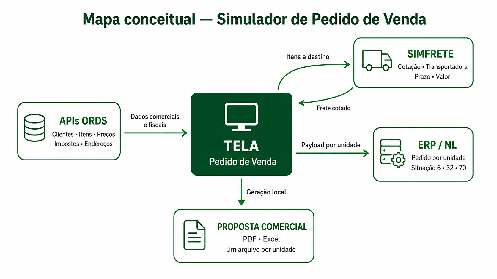
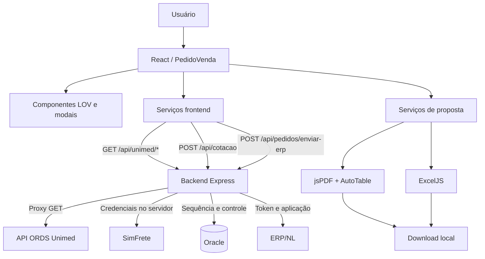
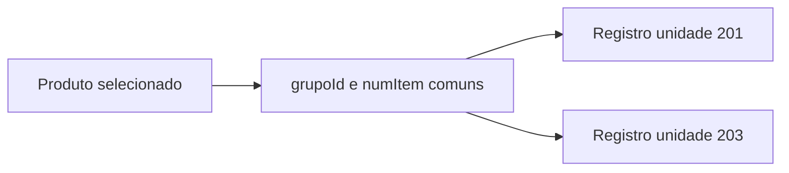

# 01 — Visão geral e arquitetura

## 1. Finalidade do sistema

O simulador apoia a elaboração de pedidos de venda para duas unidades, calcula o resultado econômico estimado de cada item, consulta frete, permite emitir propostas comerciais e integra pedidos ao ERP.

O sistema não é apenas um formulário. Ele orquestra dados cadastrais, tributários, comerciais, logísticos e históricos antes de gerar uma saída.

## 2. Escopo funcional

### Incluído

- Seleção e consulta de cliente.
- Carregamento de representante, operação, condição de pagamento e indicadores financeiros.
- Pesquisa e seleção múltipla de itens.
- Estoque, preço de lista, custo médio, tributação e classificação por unidade.
- Acordos comerciais, últimas compras e lotes próximos do vencimento.
- Cálculo de valor total, impostos, frete e sobra.
- Cotação de frete no SimFrete e seleção de transportadora.
- Observações e ordem de compra.
- Triangulação de cliente e operação de remessa.
- Endereço de entrega.
- Modalidade de integração.
- Emissão de PDF e Excel.
- Envio de um pedido por unidade ao ERP.
- Registro técnico da integração em Oracle.

### Fora do escopo atual

- Persistência de rascunhos da tela.
- Recuperação de uma simulação após recarregar o navegador.
- Armazenamento das propostas emitidas.
- Autenticação própria do frontend.
- Tela de acompanhamento do registro `PEDIDO_ERP_INTEGRACAO`.
- Reprocessamento de integração pela interface.
- Testes automatizados configurados no projeto.

## 3. Atores e sistemas

| Ator ou sistema | Responsabilidade |
|---|---|
| Usuário comercial | Configura pedido, preços, quantidades, frete e saída |
| Frontend React | Interface, estado, cálculos, validações e montagem inicial dos dados |
| Backend Node/Express | Camada de proxy que centraliza credenciais, número do pedido e auditoria da integração |
| API Unimed/ORDS | Cadastros, tributação, histórico, estoque, classificações e endereços |
| SimFrete | Retorna alternativas de transporte por origem/destino |
| Oracle | Gera sequência e registra payload, resposta e erro da integração |
| ERP/NL | Recebe o pedido definitivo por unidade |
| Navegador | Gera e baixa PDF/Excel localmente |

## 4. Arquitetura lógica

### 4.1 Mapa conceitual simplificado

A visão abaixo resume o papel central da tela e suas principais entradas e saídas.



### 4.2 Diagrama técnico



## 5. Arquitetura do frontend

### Entrada e roteamento

- `src/index.js`: inicialização do React.
- `src/App.js`: entrega o `RouterProvider`.
- `src/routes.js`: define a rota `/`.
- `src/views/RootLayout.js`: renderiza cabeçalho e conteúdo.
- `src/views/PedidoVenda.js`: concentra o fluxo principal.

### Componentes

```text
RootLayout
├── Header
└── PedidoVenda
    ├── LOVs cadastrais
    │   ├── LovClientes
    │   ├── LovRepresentantes
    │   ├── LovOperacoes
    │   ├── LovCondPgto
    │   ├── LovItens
    │   ├── LovCep / LovUf / LovCidades
    │   └── LovEnderecos
    ├── LovObservacao
    ├── LovUnidadesPedido
    ├── ModalErro / sucesso
    ├── ModalConfirmacao
    ├── ModalEmitirProposta
    └── LoadingOverlay
```

### Organização de responsabilidades

| Camada | Responsabilidade |
|---|---|
| `views` | Estado e coordenação do caso de uso |
| `components` | Interface reutilizável e interação modal |
| `services` | Acesso a API ou geração de saída |
| `config` | Clientes HTTP e configurações estáticas |
| `hooks` | Paginação/cache reutilizável de LOV |
| `utils` | Formatação e entrada monetária |
| `style` | CSS por contexto |

## 6. Estado da tela

O estado é mantido em memória por `PedidoVenda`. Os principais grupos são:

- **Entidades:** cliente, cliente detalhado, representante, operação, condição, triangulação, UF e cidade.
- **Digitação:** códigos e campos de endereço, ordem de compra e data de carga.
- **Itens:** coleção `itensPedido`, seleção, ordenação e frete rateado.
- **Frete:** cotações e transportadora selecionada por unidade.
- **Cliente:** histórico, crédito e últimas compras.
- **Interface:** abertura de LOVs, modais, menus e loading.
- **Integração:** modalidade, unidades escolhidas e situações calculadas.

Não existe persistência automática. Atualizar a página elimina o estado.

## 7. Modelo de unidades

Cada produto escolhido na LOV cria dois registros internos:



Os registros compartilham a identidade comercial do produto, mas possuem dados independentes de estoque, custo, tributação, quantidade, preço, seleção, frete e sobra.

## 8. Estratégia de integração

Na topologia padrão de produção com Docker/Podman e Nginx, o frontend usa caminhos `/api/*` e não chama ORDS, SimFrete ou ERP diretamente. Como as URLs são configuráveis por ambiente, uma implantação diferente deve preservar essa separação. O backend:

1. protege credenciais;
2. aplica timeouts;
3. gera o número do pedido em Oracle;
4. grava payload e status;
5. envia ao ERP com headers técnicos;
6. registra resposta ou erro.

## 9. Concorrência e cache

- Requisições repetidas de impostos usam cache de cinco minutos por contexto completo.
- Clientes, itens e lotes também possuem cache de cinco minutos.
- O hook reutilizável de paginação possui suporte a cache por `cacheKey`, mas as LOVs atuais não fornecem essa chave; esse cache compartilhado permanece inativo.
- Alguns serviços de catálogo, lotes, impostos e dados auxiliares compartilham promessas em andamento para evitar duplicação.
- Enriquecimento de itens limita concorrência, normalmente a três, quatro ou cinco chamadas simultâneas conforme o fluxo.
- As LOVs baseadas no hook paginado, além das LOVs de clientes e itens, usam identificadores de requisição para evitar que respostas antigas sobrescrevam o estado mais recente; essa proteção não é universal em todos os componentes.

## 10. Decisões arquiteturais relevantes

### Geração de propostas no navegador

PDF e Excel não passam pelo backend e não são armazenados. As bibliotecas são carregadas sob demanda, preservando o tamanho do pacote inicial.

### Separação por unidade

Pedidos ERP e propostas são gerados por unidade e podem ter conteúdo e frete diferentes. Somente o fluxo ERP atribui situação e número de pedido a cada unidade.

### Cálculos no frontend

Sobra, impostos estimados e rateio de frete são calculados no navegador. Mudanças em regras fiscais exigem revisão coordenada com o contrato do ERP e com as APIs de tributação.

## 11. Pontos de atenção arquiteturais

1. `PedidoVenda.js` concentra muitas responsabilidades e é um ponto natural de refatoração futura.
2. O backend está concentrado em `server.js`; separar rotas, serviços e repositório Oracle reduziria risco.
3. Alguns erros de consultas auxiliares são silenciados ou exibidos com `alert`, enquanto outros usam modal.
4. Não há suíte de testes automatizados no estado atual.
5. Cálculos dependem de campos e semânticas de APIs legadas; alterações de contrato devem ser tratadas como mudanças críticas.
6. Trocas de contexto comercial precisam invalidar preço, tributação e frete de forma coordenada; hoje essa invalidação não é uniforme para todos os campos.
7. O envio simultâneo de 201 e 203 pode terminar parcialmente: uma unidade pode ser criada mesmo que a outra apresente erro.
