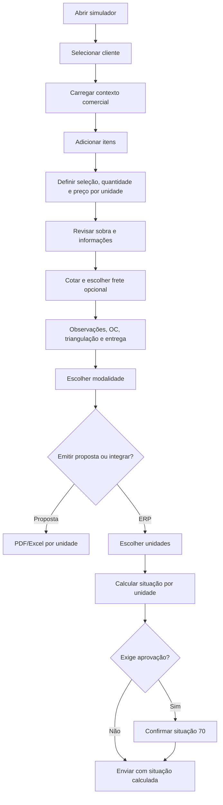

# 02 — Fluxo funcional da tela

## 1. Visão da jornada



## 2. Abertura da tela

Ao carregar a rota `/`, o sistema:

1. renderiza o cabeçalho e a tela `PedidoVenda`;
2. inicia o carregamento dos tipos de logradouro, percorrendo todas as páginas da API;
3. inicializa a modalidade de integração em **2 — Orçamento**;
4. mantém cliente, itens e demais campos vazios;
5. prepara caches em memória para dados consultados durante a sessão.

## 3. Seção “Pedido de Venda”

### 3.1 Cliente

O cliente pode ser informado pelo código ou escolhido na LOV.

Ao selecionar ou trocar o cliente, o sistema:

- limpa endereço anterior;
- limpa seleção de frete;
- solicita detalhes do cliente;
- carrega representante padrão;
- carrega operação e condição padrão quando retornadas;
- consulta indicadores financeiros e consumidor final;
- carrega observações cadastradas;
- carrega histórico do cliente;
- carrega últimas compras agrupadas por item;
- recalcula dados de todos os itens existentes para o novo contexto.

O recálculo reconsulta impostos, acordos e histórico por item/unidade. Item sem tributação é automaticamente desmarcado.

#### Sinaleira de histórico

O indicador ao lado do cliente resume a recência de compra:

- verde: compra recente, até 45 dias;
- amarelo: compra antiga, acima de 45 dias;
- vermelho: cliente nunca comprado ou sem histórico válido.

O tooltip apresenta detalhes da última compra.

### 3.2 Representante

É carregado a partir do cliente, mas pode ser pesquisado ou alterado. A pesquisa por código considera a combinação representante/cliente.

### 3.3 Operação

Pode vir do cadastro do cliente ou ser escolhida manualmente.

Ao trocar a operação com itens já incluídos:

- o frete escolhido é limpo;
- os itens são recalculados em concorrência controlada;
- tributação, lista, preço e indicadores derivados podem mudar;
- itens que ficarem sem tributação são desmarcados.

### 3.4 Condição de pagamento

Pode vir do cliente ou ser escolhida manualmente. A tela exibe uma sinaleira financeira quando houver dados:

- limite mensal;
- percentual consumido;
- títulos vencidos;
- prazo médio de venda.

### 3.5 Consumidor final

Campo somente leitura, derivado de `ind_consumidor` do detalhe do cliente.

### 3.6 Modalidade de integração

Opções:

- `2 — Orçamento` — padrão;
- `7 — Orçamento/Contrato`.

A modalidade afeta o payload ERP:

- `numSeqConf` sempre recebe o código selecionado;
- sem violação de margem, modalidade 2 usa situação 6;
- sem violação de margem, modalidade 7 usa situação 32;
- com violação de margem, ambas usam situação 70.

A modalidade não aparece nas propostas comerciais.

## 4. Seção “Itens do Pedido”

### 4.1 Pré-requisitos para abrir a LOV

Antes de adicionar um item, a tela exige:

- cliente;
- operação;
- condição de pagamento.

Sem esses dados, uma mensagem orienta o usuário.

### 4.2 LOV de itens

Características principais:

- carrega catálogo de itens com cache de cinco minutos;
- inicia com filtro `POLIMAX`;
- pesquisa por código, descrição, princípio ativo e marca/código completo;
- aceita termos separados por espaço ou `%`;
- pagina 25 itens;
- permite ordenação por colunas;
- permite seleção múltipla;
- impede adicionar novamente um item já presente;
- consulta preços das unidades 201 e 203;
- consulta acordos do cliente;
- exibe última compra e observações;
- destaca marca própria, acordo, última compra e lote próximo.

O loading da busca cobre toda a área visível da lista, independentemente da posição de rolagem.

### 4.3 Inclusão de um produto

Cada produto selecionado gera:

- um registro para unidade 201;
- um registro para unidade 203;
- mesmo `grupoId` e `numItem` lógico;
- `seq` técnico diferente em cada unidade.

Depois da inclusão, o sistema consulta em lote os detalhes do item e enriquece cada registro com:

- estoque;
- custo médio;
- múltiplo;
- dimensões, volume e peso;
- preço e lista;
- impostos;
- ST/DIFAL;
- acordo comercial;
- última compra;
- classificação;
- indicador de tributação.

### 4.4 Grade principal

A grade da esquerda mostra a identidade do produto. As grades 201 e 203 mostram dados específicos de cada unidade.

#### Colunas por unidade

- Enviar.
- Quantidade.
- Estoque.
- Valor de lista.
- Valor total.
- Sobra percentual.
- Informações detalhadas.

### 4.5 Seleção

- O checkbox define se o registro daquela unidade participa dos próximos fluxos.
- “Marcar todos” e “Desmarcar todos” atuam somente na unidade escolhida.
- Item sem tributação permanece desmarcado e não pode ser marcado.
- Remover na grade principal elimina as duas representações do produto.

### 4.6 Quantidade

- Deve ser maior que zero para cotação ou ERP.
- Quando existe múltiplo, a quantidade deve ser divisível por ele.
- Quantidade inválida por múltiplo é limpa e uma mensagem é exibida.

### 4.7 Valor de lista

- Aceita digitação decimal natural com vírgula ou ponto.
- Permite até quatro casas decimais.
- Exemplo: `9,30`, sem necessidade de digitar `93000`.
- Lista promocional não permite preço abaixo do valor original.
- Lista de contrato bloqueia alteração do preço e da sobra.

### 4.8 Sobra editável

Ao editar a sobra, o sistema calcula o preço unitário necessário para atingir o percentual solicitado.

- O percentual não pode atingir ou ultrapassar o limite matemático disponível depois dos tributos.
- Lista promocional continua respeitando o preço mínimo.
- O valor recalculado é arredondado para quatro casas.
- Apenas navegar pelo campo não recalcula o preço; isso evita perda por arredondar a sobra exibida em duas casas.

### 4.9 Navegação por teclado

Enter e Tab seguem esta ordem lógica, ignorando campos desabilitados:

```text
201: todas as quantidades
  → todos os valores
  → todas as sobras
203: todas as quantidades
  → todos os valores
  → todas as sobras
```

- Enter no último campo reinicia no primeiro campo disponível.
- `Shift + Enter` percorre em sentido inverso.
- Tab sai normalmente ao alcançar a extremidade.
- O conteúdo do próximo campo é selecionado.

Mensagens com somente o botão **OK** dão foco automático ao botão; Enter fecha a mensagem.

### 4.10 Legenda visual

O ícone de informação ao lado de “Itens” explica:

| Cor/símbolo | Significado |
|---|---|
| Roxo + `©` | Acordo comercial |
| Verde + `✓` | Item presente em última compra |
| Laranja + `$` | Preço bloqueado por contrato; a legenda da interface também menciona promoção, embora o destaque seja aplicado ao contrato |
| Marrom + `!` | Item sem tributação |
| Vermelho + ampulheta | Lote com validade próxima |

Também apresenta margens mínimas: AC 4%, MMT 6% e total da unidade 6%.

#### Prioridade da cor da linha

Quando um item atende a mais de uma condição, a classe visual segue esta prioridade:

1. sem tributação;
2. lote próximo;
3. preço bloqueado;
4. acordo;
5. última compra.

Os símbolos individuais ainda podem indicar outras condições simultâneas.

### 4.11 Tooltip “Info”

Exibe, conforme disponibilidade:

- custo médio;
- preço, quantidade e totais;
- ICMS, ST, DIFAL, PIS, COFINS, IPI, FCP e Funrural;
- frete rateado;
- sobra em valor;
- transportadora e prazo;
- última compra e ticket médio;
- pedidos vinculados a acordo;
- histórico de até cinco compras.

## 5. Cotação de frete

### 5.1 Entrada

O botão “Cotar SimFrete” utiliza somente itens selecionados. Cada item deve possuir unidade e quantidade válida.

### 5.2 Processamento

1. A seleção anterior é limpa.
2. Frete rateado dos itens é zerado.
3. O sistema agrupa itens por unidade.
4. Envia uma cotação por origem.
5. Recebe transportadoras por unidade.
6. Seleciona automaticamente a primeira alternativa de cada unidade.
7. Rateia o valor entre os itens selecionados.

### 5.3 Alteração de transportadora

O usuário pode escolher outra opção no tooltip de frete. A troca recalcula o rateio e, consequentemente, a sobra dos itens e da unidade.

### 5.4 Exibição

Cada unidade mostra:

- valor total dos produtos;
- frete em percentual e valor, ou “Não cotado”;
- sobra em percentual e valor.

## 6. Observações

O cliente pode trazer comentários previamente cadastrados. O usuário pode:

- adicionar;
- editar;
- remover;
- marcar destino: pedido, nota fiscal, registro de saídas e/ou contas a receber.

Somente observações com ao menos um destino marcado entram no payload ERP. Na proposta, entram somente as marcadas para pedido.

## 7. Ordem de compra

- Obrigatória para integração ERP.
- Limitada a 20 caracteres pela interface.
- Não aceita `|` ou `/`.
- Opcional na proposta; quando preenchida, é exibida no PDF, mas não no Excel atual.

## 8. Triangulação

Permite configurar:

- cliente de remessa;
- operação de remessa.

Quando preenchidos, geram `codClienteRemessa` e `codOperRemessa` no ERP. Não são incluídos na proposta atual.

## 9. Endereço de entrega

Pode ser preenchido por:

- endereço padrão do cliente;
- LOV de endereços;
- consulta por CEP;
- seleção direta de UF e cidade;
- digitação manual.

Campos disponíveis:

- CEP;
- UF;
- cidade/código IBGE;
- tipo de logradouro;
- logradouro;
- número;
- complemento;
- bairro;
- referência;
- data da carga.

O payload ERP atual envia endereço combinado, logradouro, código do tipo, bairro, código da cidade, CEP, número e data. Complemento e referência estão disponíveis na tela e no modelo da proposta, mas não são enviados no `peEndEntrega` atual. O PDF apresenta ambos; o Excel apresenta o complemento, mas atualmente omite a referência.

## 10. Emissão de proposta

### Validações

- cliente selecionado;
- condição de pagamento selecionada;
- pelo menos um item marcado.

### Saída

- usuário escolhe PDF ou Excel;
- o contato do cliente é atualizado por `clientes/{codigo}`;
- somente itens selecionados são considerados;
- cada unidade produz um arquivo independente;
- frete entra apenas quando cotado;
- validade é emissão + 15 dias;
- download ocorre no navegador;
- nada é salvo no backend.

## 11. Envio ao ERP

### 11.1 Validação inicial

Antes de abrir a seleção de unidades, são exigidos:

- ao menos um item selecionado;
- nenhum item selecionado sem tributação;
- quantidade positiva em todos os selecionados;
- cliente;
- operação;
- condição de pagamento;
- ordem de compra.

### 11.2 Seleção de unidades

A LOV mostra apenas unidades que possuem itens marcados. É possível escolher uma ou ambas.

### 11.3 Avaliação de margem

A avaliação é independente por unidade. Ela consulta a classificação dos itens e calcula:

- sobra total da unidade;
- sobra individual de itens AC e MMT.

### 11.4 Confirmação

Se a unidade exigir situação 70, um modal identifica a unidade e o motivo. Quando a sobra total está abaixo de 6%, a mensagem prioriza o percentual total. Quando o total foi atingido e há desvios individuais, lista sequência, código, segmento, sobra atual e mínimo de cada item.

**Sim, enviar:** continua o envio de todas as unidades escolhidas; cada unidade com desvio usa situação 70, enquanto as demais mantêm 6 ou 32 conforme a modalidade.

**Não:** fecha a confirmação e mantém a tela para edição.

### 11.5 Envio e retorno

Os payloads são enviados em paralelo. No sucesso, o modal lista o número retornado para cada unidade. Ao fechar a mensagem de sucesso, a tela inteira é limpa.

Em erro, a mensagem pode exibir etapa, número já gerado e detalhe retornado pelo backend.
