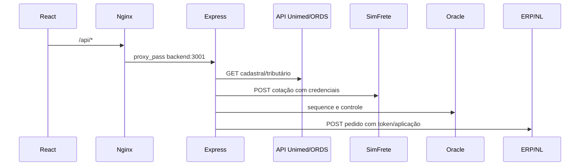
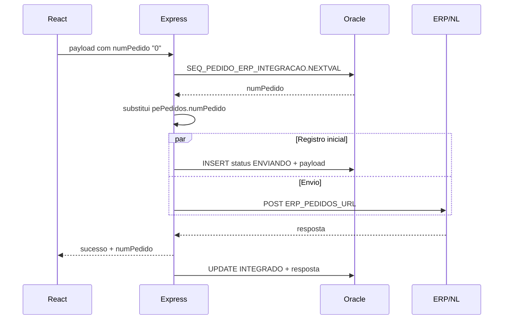

# 04 — Integrações e catálogo de APIs

## 1. Topologia

Em produção, o navegador usa apenas o host do frontend:



## 2. Clientes HTTP do frontend

### API Unimed

Arquivo: `src/config/apis.js`.

```text
Base URL: REACT_APP_UNIMED_API_BASE_URL
Produção padrão: /api/unimed/
Content-Type: application/json
```

### Backend de frete/ERP

Arquivos: `src/config/simFreteService.js` e `src/services/pedidosErp.js`.

```text
Base URL: REACT_APP_SIMFRETE_API_BASE_URL
Produção padrão: /
Cotação timeout: 20 s
Pedido timeout: 30 s
```

## 3. Catálogo ORDS usado pelo frontend

Todos os caminhos abaixo são relativos a `REACT_APP_UNIMED_API_BASE_URL`.

| Domínio | Método e caminho | Finalidade | Consumidor |
|---|---|---|---|
| Clientes | `GET clientes` | Catálogo completo para LOV | `LovClientes` |
| Clientes | `GET clientes/{filtro}` | Busca por código/nome/CNPJ e contato da proposta | Tela/proposta |
| Clientes | `GET ClienteDetalhado/{codPessoa}` | Operação, pagamento, crédito, consumidor e dados complementares | Tela |
| Clientes | `GET clientesComentarios/{cliente}` | Comentários/observações | Tela |
| Clientes | `GET clientesHistorico/{cliente}` | Recência e status de compra | Tela |
| Clientes | `GET clientesUltimaCompra/{cliente}` | Últimas compras agrupadas por item | Tela/LOV |
| Representantes | `GET representantesCliente/{cliente}` | Representante padrão | Tela |
| Representantes | `GET representantes/{representante}/{cliente}` | Validação de representante | Tela |
| Operações | `GET operacoes` | LOV | `LovOperacoes` |
| Operações | `GET operacoes/{filtro}` | Busca direta | Tela |
| Pagamento | `GET condPgto` | LOV | `LovCondPgto` |
| Pagamento | `GET condPgto/{filtro}` | Busca direta | Tela |
| Itens | `GET itens` | Catálogo da LOV | `LovItens` |
| Itens | `GET itensDetalhados/{codigosCSV}` | Estoque, custo, múltiplo, dimensão e peso | Inclusão |
| Itens | `GET itensClassificacao/{codigosCSV}` | Segmento técnico para exibição e regra AC/MMT | Tela/ERP |
| Itens | `GET itensLotes` | Lotes próximos do vencimento | LOV/tela |
| Itens | `GET itensAcordos/{item}/{cliente}` | Acordos comerciais | LOV/tela |
| Itens | `GET itensUltimaCompra/{item}/{cliente}` | Última compra específica | Tela |
| Tributação | `GET impostos/{oper}/{unidade}/{cliente}/{condPgto}/{item}` | Preço e tributação por contexto | LOV/tela |
| Lista | `GET listaPreco/{lista}/{item}` | Promoção, contrato e base ST | Tela |
| CEP | `GET ceps` | LOV | `LovCep` |
| CEP | `GET ceps/{filtro}` | Busca por CEP | Tela |
| Cidade | `GET cidades` | LOV | `LovCidades` |
| Cidade | `GET cidades/{filtro}` | Busca por código IBGE | Tela |
| UF | `GET uf` | LOV | `LovUf` |
| UF | `GET uf/{filtro}` | Busca direta | Tela |
| Tipo logradouro | `GET tipLogradouro` | Tipos e `cod_tipo` | Tela |
| Endereço | `GET psEnderecos/{cliente}` | Endereços alternativos | `LovEnderecos` |
| Endereço | `GET psPessoasPadrao/{cliente}` | Endereço padrão | Tela |

Parâmetros comuns de paginação: `offset` e `limit`, normalmente 25.

## 4. Normalização de respostas

`ceps.js`, `enderecos.js` e `enderecosPadrao.js` aceitam três formatos:

- `{ items: [...] }`;
- array direto;
- objeto único.

Todos são convertidos para uma estrutura com `items`, `hasMore` e `count`.

Outros serviços normalmente esperam o envelope ORDS:

```json
{
  "items": [],
  "hasMore": false,
  "count": 0
}
```

## 5. Cache e deduplicação

| Dado | Chave | TTL | Observação |
|---|---|---:|---|
| Clientes completos | global | 5 min | Compartilha requisição em andamento |
| Itens completos da LOV | global | 5 min | Filtro/paginação são locais |
| Lotes | global | 5 min | Compartilha requisição |
| Impostos | operação, unidade, cliente, pagamento e item | 5 min | Remove cache se falhar |
| Páginas de LOV | componente, filtro, offset e limite | 5 min | Suporte do hook `useLovPagination`; inativo atualmente porque as LOVs não fornecem `cacheKey` |
| Lista de preço | lista e item | sessão da tela | `useRef(Map)` |
| Acordos | cliente e item | sessão/módulo | Promessa e resultado |
| Última compra | cliente e item | sessão da tela | Promessa e resultado |

### Proteção contra corrida

- LOVs baseadas no hook paginado, além das LOVs de clientes e itens, usam contador de requisição; componentes como `LovEnderecos` não possuem a mesma proteção.
- Mudanças de cliente/operação usam `recalculoClienteId`.
- Respostas de um contexto antigo não devem sobrescrever o contexto novo.

## 6. SimFrete

### 6.1 Endpoint interno

```http
POST /api/cotacao
```

### 6.2 Agrupamento

O frontend gera um payload para cada unidade com itens selecionados.

### 6.3 Configuração de origem

| Unidade | CNPJ remetente | CEP origem |
|---:|---|---:|
| 201 | `02494715000173` | `92120190` |
| 203 | `02494715000416` | `29167650` |

### 6.4 Payload frontend → backend

```json
{
  "remetenteCnpj": "02494715000173",
  "origem": 92120190,
  "destino": 3526902,
  "volumeTotal": 1.2345,
  "valorTotal": 1500.50,
  "pesoTotal": 125.350,
  "quantidadeTotalDecimal": 10,
  "quantidadeTotal": 10
}
```

`destino` usa `cliente.cod_cidade` mesclado com `ClienteDetalhado`.

### 6.5 Backend → SimFrete

O backend acrescenta:

```json
{
  "wsEmp": "central unimed",
  "wsUsr": "<SIMFRETE_USER>",
  "wsPwd": "<SIMFRETE_PASS>"
}
```

Endpoint externo fixo no backend:

```text
https://centralunimed.simfrete.com/CotacaoService/consultar
```

Credenciais nunca devem ser enviadas pelo frontend.

### 6.6 Normalização do retorno

Cada transportadora é convertida para:

```json
{
  "nome": "SIGLA",
  "prazo": 8,
  "valor": 80.98,
  "cnpj": "...",
  "tipoRateio": "...",
  "raw": {}
}
```

## 7. Proxy ORDS

O backend atende `GET /api/unimed/*`.

Regras:

- somente GET é permitido;
- path e query string são encaminhados;
- timeout do cliente ORDS: 20 segundos;
- erro externo retorna status original quando disponível e mensagem genérica.

## 8. Integração ERP

### Endpoint interno

```http
POST /api/pedidos/enviar-erp
```

### Sequência técnica



### Headers externos

```text
Content-Type: application/json
x-nl-token: ERP_NL_TOKEN
x-nl-aplicacao: ERP_NL_APLICACAO
```

### Registro Oracle

Tabela: `PEDIDO_ERP_INTEGRACAO`.

| Campo | Uso |
|---|---|
| `NUM_PEDIDO` | Sequência gerada |
| `STATUS` | `ENVIANDO`, `INTEGRADO` ou `ERRO` |
| `PAYLOAD` | JSON efetivamente enviado em CLOB |
| `USUARIO` | Usuário vindo da URL, se disponível |
| `RESPOSTA_ERP` | Resposta do ERP em CLOB |
| `ERRO` | Detalhe da falha em CLOB |
| `DATA_ENVIO` | Momento da conclusão ou erro |

### Observação transacional

O `INSERT` inicial usa `autoCommit` e ocorre em paralelo ao POST. O frontend pode receber sucesso antes de o `UPDATE INTEGRADO` terminar, pois a resposta HTTP é enviada antes desse update no fluxo atual.

## 9. Contrato de erros do ERP

Exemplo:

```json
{
  "sucesso": false,
  "numPedido": 123456,
  "erro": "Erro ao integrar pedido com o ERP",
  "etapa": "atualizar_integracao_erro",
  "detalhe": {}
}
```

Etapas internas registradas nos logs:

- `inicio`;
- `conectar_oracle`;
- `gerar_numero_pedido`;
- `montar_payload_erp`;
- `inserir_controle_integracao`;
- `post_erp`;
- `atualizar_integracao_sucesso`;
- `atualizar_integracao_erro`.

O campo `etapa` retornado ao frontend exige interpretação cuidadosa:

- falhas antes de gerar um número podem retornar a etapa original, como `conectar_oracle` ou `gerar_numero_pedido`;
- depois que existem conexão e número, o `catch` muda a etapa para `atualizar_integracao_erro` antes de responder, podendo ocultar no JSON a etapa original do POST ou INSERT;
- uma falha em `atualizar_integracao_sucesso` acontece depois de a resposta de sucesso já ter sido enviada e, portanto, aparece apenas nos logs;
- os logs emitidos antes da tentativa de atualização de erro preservam a etapa original e são a evidência mais confiável para diagnóstico.

## 10. Health check

```http
GET /health
```

Resposta:

```json
{ "ok": true }
```

O health check confirma apenas que o processo HTTP responde; não valida ORDS, Oracle, SimFrete ou ERP.

## 11. Timeouts

| Integração | Timeout |
|---|---:|
| ORDS no backend | 20 s |
| SimFrete externo | 20 s |
| Pedido frontend → backend | 30 s |
| ERP no backend | 30 s |

## 12. Pontos de atenção

1. O proxy ORDS não faz cache no backend; cache existe no navegador.
2. Falhas de algumas consultas auxiliares retornam valores vazios para não bloquear a experiência.
3. O health check não mede dependências.
4. O backend exige todas as credenciais e Oracle já na inicialização, mesmo que o usuário queira apenas consultar dados.
5. CORS está aberto no backend; em produção o acesso esperado é pelo Nginx.
6. Logs podem conter detalhes do retorno externo; revisar política de dados sensíveis.
7. O `INSERT` de controle e o POST ao ERP são iniciados em paralelo; o ERP pode aceitar o pedido mesmo se o registro inicial falhar.
8. O frontend envia as unidades em paralelo. Uma falha geral não significa necessariamente que nenhuma unidade foi integrada; antes de repetir, consultar a tabela de controle e o ERP.
9. Não existe atualmente chave de idempotência ou reconciliação automática. Uma repetição sem conferência pode duplicar o pedido.
10. O endpoint de pedido aceita o corpo montado pelo navegador sem validação formal de schema e o usuário de auditoria vem da URL; autenticação, autorização e validação devem ser tratadas como melhorias prioritárias.
11. Caches de alguns dados auxiliares não possuem TTL e podem armazenar inclusive um fallback vazio após falha, impedindo nova tentativa até a tela ser desmontada.
12. Alterar a condição de pagamento não aciona o mesmo recálculo de preço/imposto executado ao alterar a operação.
