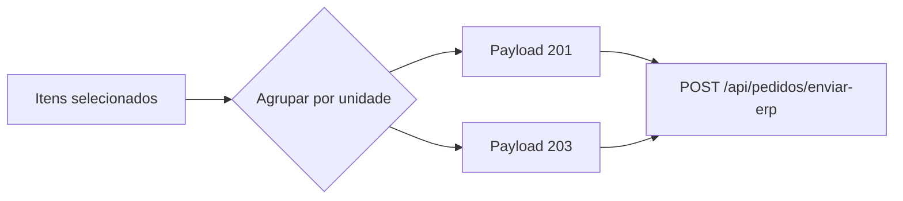

# 05 — Contrato do payload ERP

## 1. Regra de geração

O frontend gera um JSON independente para cada unidade escolhida que possua itens marcados.



Os envios são disparados em paralelo com `Promise.all`.

## 2. Exemplo completo

```json
{
  "codEmp": "01",
  "codMaquina": 1,
  "usuario": "usuario.url",
  "pePedidos": {
    "codEmp": "01",
    "codUnidade": 201,
    "numPedido": "0",
    "numSeqConf": 2,
    "codCompl": 99,
    "desNumOcCliente": "OC-12345",
    "codSituacao": 6,
    "dtaEmissao": "18/08/2026",
    "dtaDigitacao": "18/08/2026",
    "tipFrete": 1,
    "codCondPgto": "8",
    "codOper": "150",
    "codOperRemessa": "151",
    "indConsumidor": 1,
    "codCliente": "22222",
    "codClienteRemessa": "33333",
    "codRepresentante": "18305",
    "tipTransacao": 1,
    "peItens": [
      {
        "codItem": "12962",
        "codLista": "100",
        "codReserva": 7,
        "qtdNegociada": 10,
        "vlrUniBruto": "984,8151",
        "codUnidadeRetira": 201,
        "tipTransacao": 1,
        "qtdReservada": 10,
        "indVlrAlterado": 0,
        "numItem": 1
      }
    ],
    "peObservacoes": [
      {
        "txtObs": "Entregar pela manhã",
        "indPedido": 1,
        "indNf": 0,
        "indRegistro": 0,
        "indCr": 0,
        "numSeq": 1,
        "tipTransacao": 1
      }
    ],
    "peEndEntrega": {
      "codEmp": "01",
      "codUnidade": 201,
      "codCompl": 99,
      "desEndereco": "RUA SANTA CRUZ",
      "desLogradouro": "SANTA CRUZ",
      "codLogradouro": 1,
      "desBairro": "CENTRO",
      "codCidade": 3526902,
      "numCep": 13480041,
      "numLogradouro": 684,
      "dtaTransacao": "18/08/2026",
      "tipTransacao": 1
    }
  }
}
```

O exemplo é ilustrativo. Campos opcionais vazios são removidos antes do envio.

## 3. Envelope

| Campo | Tipo | Origem | Obrigatoriedade atual |
|---|---|---|---|
| `codEmp` | string | Fixo `01` | Sempre |
| `codMaquina` | number | Fixo `1` | Sempre |
| `usuario` | string | Query string da URL | Opcional |
| `pePedidos` | object | Montagem da unidade | Sempre |

### Resolução do usuário

A tela procura, nesta ordem:

1. `usuario`;
2. `user`;
3. `codUsuario`;
4. `cod_usuario`.

Se nenhum existir, o campo é removido.

## 4. Cabeçalho `pePedidos`

| Campo | Tipo | Regra/origem |
|---|---|---|
| `codEmp` | string | `01` |
| `codUnidade` | number | 201 ou 203 |
| `numPedido` | string | Frontend envia `0`; backend substitui pela sequência Oracle |
| `numSeqConf` | number | Modalidade 2 ou 7 |
| `codCompl` | number | `99` |
| `desNumOcCliente` | string | Ordem de compra |
| `codSituacao` | number | 6, 32 ou 70 |
| `dtaEmissao` | string | Data local `dd/MM/yyyy` |
| `dtaDigitacao` | string | Data local `dd/MM/yyyy` |
| `tipFrete` | number | `1` fixo |
| `codCondPgto` | string | Condição selecionada |
| `codOper` | string | Operação selecionada |
| `codOperRemessa` | string | Operação da triangulação, opcional |
| `indConsumidor` | number | 1 quando cliente detalhado indica consumidor; senão 0 |
| `codCliente` | string | Cliente principal |
| `codClienteRemessa` | string | Cliente da triangulação, opcional |
| `codRepresentante` | string | Representante, opcional |
| `tipTransacao` | number | `1` fixo |
| `peItens` | array | Itens marcados da unidade |
| `peObservacoes` | array | Opcional |
| `peEndEntrega` | object | Opcional |

## 5. Modalidade e situação

| Modalidade selecionada | `numSeqConf` | Situação sem aprovação | Situação com margem insuficiente |
|---|---:|---:|---:|
| 2 — Orçamento | 2 | 6 | 70 |
| 7 — Orçamento/Contrato | 7 | 32 | 70 |

Consultar [Regras de negócio e cálculos](03-regras-negocio-calculos.md) para a avaliação completa.

## 6. Item `peItens[]`

| Campo | Tipo | Regra/origem |
|---|---|---|
| `codItem` | string | `item.cod_item` |
| `codLista` | string | Lista encontrada na tributação (`cod_lista`) |
| `codReserva` | number | `7` fixo |
| `qtdNegociada` | number | Quantidade da unidade |
| `vlrUniBruto` | string | Preço com quatro casas e vírgula |
| `codUnidadeRetira` | number | Mesma unidade do payload |
| `tipTransacao` | number | `1` fixo |
| `qtdReservada` | number | Mesma quantidade negociada |
| `indVlrAlterado` | number | `0` fixo |
| `numItem` | number | Sequência lógica comum ao produto nas duas unidades |

## 7. Observação `peObservacoes[]`

| Campo | Tipo | Regra/origem |
|---|---|---|
| `txtObs` | string | Descrição ou `-` |
| `indPedido` | number | Checkbox Pedido |
| `indNf` | number | Checkbox Nota fiscal |
| `indRegistro` | number | Checkbox Registro de saídas |
| `indCr` | number | Checkbox Contas a receber |
| `numSeq` | number | Posição após filtrar observações marcadas |
| `tipTransacao` | number | `1` |

Observações sem qualquer destino marcado não são enviadas.

## 8. Endereço `peEndEntrega`

O objeto é criado quando existe pelo menos um destes valores: CEP, logradouro, bairro, número, complemento, referência ou tipo de logradouro. Cidade, UF ou data de carga isoladas não ativam `peEndEntrega` no comportamento atual.

| Campo | Tipo | Regra/origem |
|---|---|---|
| `codEmp` | string | `01` |
| `codUnidade` | number | Unidade do pedido |
| `codCompl` | number | `99` |
| `desEndereco` | string | Tipo + logradouro, ou somente logradouro |
| `desLogradouro` | string | Logradouro sem o tipo |
| `codLogradouro` | number/string | `cod_tipo` encontrado pelo `des_tipo` selecionado |
| `desBairro` | string | Bairro |
| `codCidade` | number | Código IBGE digitado/selecionado |
| `numCep` | number | Somente dígitos |
| `numLogradouro` | number | Somente dígitos; zero quando vazio |
| `dtaTransacao` | string | Data da carga ou data atual |
| `tipTransacao` | number | `1` |

### Campos de tela não enviados atualmente

- complemento;
- referência;
- descrição da cidade;
- UF.

## 9. Limpeza de campos

`limparCamposVazios` percorre recursivamente objetos e arrays.

Remove:

- `null`;
- `undefined`;
- string vazia;
- array vazio.

Preserva:

- zero;
- `false`;
- objeto vazio, se produzido indiretamente.

## 10. Transformação no backend

O backend substitui apenas:

```text
pePedidos.numPedido = String(sequence Oracle)
```

O restante do contrato é encaminhado como recebido.

## 11. Resposta de sucesso

```json
{
  "sucesso": true,
  "numPedido": 123456,
  "retornoErp": {}
}
```

O frontend utiliza `numPedido` para compor a mensagem final por unidade.

## 12. Checklist de alteração do contrato

Ao adicionar ou mudar um campo:

1. validar nome e tipo com o ERP;
2. identificar a fonte na tela/API;
3. decidir obrigatoriedade;
4. tratar valor vazio e zero;
5. avaliar diferença entre unidades;
6. atualizar exemplo e dicionário deste documento;
7. testar payload salvo em Oracle;
8. testar resposta de erro e sucesso;
9. confirmar se a proposta comercial deve ou não refletir o campo.

## 13. Limitações e cuidados operacionais

- Não há validação final exigindo preço unitário maior que zero antes do envio.
- `indVlrAlterado` permanece `0`, mesmo quando o valor foi editado pelo usuário; a semântica deve ser confirmada com o ERP antes de qualquer alteração.
- `tipFrete` é fixo em `1`; transportadora, prazo e valor cotado não fazem parte do contrato atual, embora o frete afete a sobra.
- Complemento e referência de endereço não são enviados.
- Endereço parcial pode preservar `numCep: 0` e `numLogradouro: 0`, pois zeros não são removidos pela limpeza.
- `numItem` mantém a identidade criada para o produto e pode apresentar lacunas dentro do pedido de uma unidade.
- O fallback interno de situação é `6`. O fluxo normal sempre calcula a situação antes da montagem, mas qualquer novo chamador deve resolver modalidade e margem previamente para não enviar modalidade 7 incorretamente em situação 6.
- Como 201 e 203 são enviados em paralelo, uma mensagem de erro pode coexistir com um pedido já criado para a outra unidade. Nunca repetir a integração sem confirmar o resultado anterior.
