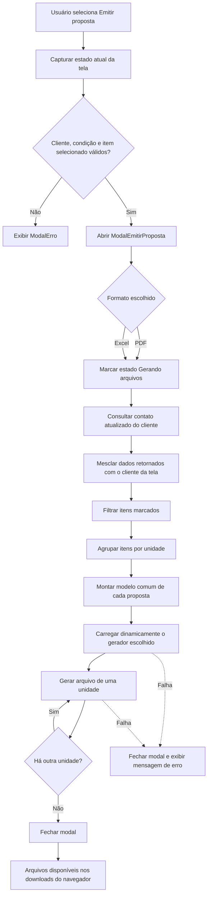

# 06 — Emissão de propostas

## 1. Objetivo

Este documento descreve a emissão de propostas comerciais em PDF e Excel pelo simulador de pedido de venda. O foco é o comportamento efetivamente implementado: dados utilizados, validações, separação por unidade, arquitetura dos serviços, geração dos arquivos, download, tratamento de falhas e pontos de manutenção.

A proposta é uma saída comercial da simulação. Ela não envia dados ao ERP, não cria pedido, não reserva estoque e não persiste um documento no backend.

> **Comportamento atual:** toda a montagem e geração ocorre no navegador. O resultado existe apenas como arquivo baixado pelo usuário.

## 2. Resultado funcional

Ao selecionar **Emitir proposta**, o usuário escolhe um dos formatos:

- **PDF:** documento em A4 paisagem, destinado à apresentação comercial;
- **Excel:** planilha editável, com cabeçalho, itens, valores e totais.

As regras gerais são:

1. somente itens marcados na tela entram na proposta;
2. cada unidade gera um arquivo independente;
3. o frete só aparece se houver uma cotação selecionada para a unidade;
4. a validade é de 15 dias a partir da emissão;
5. a proposta é baixada, sem armazenamento no backend;
6. sobra, modalidade de integração e operação não são apresentadas ao cliente.

### 2.1 Separação por unidade

Os registros internos dos itens são independentes para as unidades 201 e 203. A emissão agrupa apenas os itens marcados de cada unidade.

| Itens marcados | Arquivos gerados |
|---|---|
| Somente unidade 201 | Uma proposta da unidade 201 |
| Somente unidade 203 | Uma proposta da unidade 203 |
| Unidades 201 e 203 | Duas propostas distintas |
| Nenhum item marcado | Emissão bloqueada |

Um único PDF ou Excel nunca mistura itens das duas unidades.

## 3. Fluxo de emissão



### 3.1 Abertura

O botão está no rodapé da tela, ao lado de **Enviar pedido ao ERP**. Sua ação é `abrirEmissaoProposta`, em `src/views/PedidoVenda.js`.

Antes de abrir o seletor de formato, a tela chama `validarDadosProposta`. Se houver erro, o modal de formato não é aberto.

### 3.2 Seleção do formato

`src/components/ModalEmitirProposta.js` apresenta:

- PDF — documento pronto para apresentação;
- Excel — planilha editável com itens e totais;
- Cancelar.

Durante a geração:

- os botões PDF e Excel são desabilitados;
- Cancelar também é desabilitado;
- a mensagem **Gerando arquivos...** é exibida;
- o estado `gerandoProposta` impede uma nova ação normal pela interface.

### 3.3 Conclusão ou falha

Em caso de sucesso, o modal de formato é fechado após a geração de todos os arquivos.

Em caso de falha:

1. o modal de formato é fechado;
2. o estado de geração é encerrado;
3. `ModalErro` apresenta a mensagem recebida do serviço;
4. a mensagem identifica se a falha ocorreu na geração de PDF ou Excel.

## 4. Validações anteriores à emissão

As validações atuais estão em `validarDadosProposta`, no arquivo `src/services/proposta/propostaDataService.js`.

| Validação | Mensagem atual |
|---|---|
| Cliente não selecionado | `Selecione um cliente antes de emitir a proposta.` |
| Condição de pagamento não selecionada | `Selecione uma condição de pagamento antes de emitir a proposta.` |
| Nenhum item marcado | `Selecione ao menos um item para emitir a proposta.` |

### 4.1 O que não é validado neste fluxo

O fluxo de proposta não reaproveita todas as validações de integração com o ERP. Atualmente ele não exige explicitamente:

- operação;
- modalidade de integração;
- margem ou sobra mínima;
- endereço de entrega;
- ordem de compra;
- data de carga;
- frete cotado;
- CNPJ, telefone ou e-mail do cliente;
- quantidade maior que zero;
- valor unitário maior que zero;
- classificação AC ou MMT;
- situação ERP.

Isso permite emitir uma proposta sem frete ou endereço, mas também permite que um item marcado com quantidade ou valor zerado seja exportado.

## 5. Arquitetura da funcionalidade

```text
PedidoVenda.js
├── validarDadosProposta(...)
├── ModalEmitirProposta
├── obterDadosPropostaTela()
├── consulta complementar do cliente
├── criarPropostasPorUnidade(...)
└── exportarPropostas(...)
    ├── propostaPdfService.js
    │   ├── propostaAssetsService.js
    │   └── propostaDownloadService.js
    └── propostaExcelService.js
        ├── propostaAssetsService.js
        └── propostaDownloadService.js
```

### 5.1 Responsabilidades por arquivo

| Arquivo | Responsabilidade |
|---|---|
| `src/views/PedidoVenda.js` | Captura o estado da tela, abre o modal, consulta o contato do cliente e coordena a emissão |
| `src/components/ModalEmitirProposta.js` | Permite escolher PDF ou Excel e apresenta o estado de geração |
| `src/services/proposta/propostaDataService.js` | Valida os dados, normaliza valores, separa unidades e cria o modelo comum |
| `src/services/proposta/propostaService.js` | Carrega o gerador escolhido e processa as propostas em sequência |
| `src/services/proposta/propostaPdfService.js` | Constrói o PDF com jsPDF e AutoTable |
| `src/services/proposta/propostaExcelService.js` | Constrói a planilha com ExcelJS |
| `src/services/proposta/propostaAssetsService.js` | Carrega e converte o logotipo para Data URL |
| `src/services/proposta/propostaDownloadService.js` | Monta nomes seguros e inicia o download do Blob |
| `src/config/propostaConfig.js` | Mantém dados institucionais, CNPJ das unidades e validade |
| `src/services/clientes.js` | Consulta os dados de contato complementares do cliente |

### 5.2 Princípio de manutenção

PDF e Excel não leem diretamente o estado de `PedidoVenda`. Ambos recebem o mesmo modelo criado por `propostaDataService`.

Essa separação evita duplicar regras como:

- seleção de itens;
- agrupamento por unidade;
- validade;
- normalização numérica;
- cálculo de totais;
- definição do frete;
- dados institucionais.

Diferenças de layout permanecem isoladas nos geradores de cada formato.

## 6. Captura dos dados da tela

`obterDadosPropostaTela`, em `PedidoVenda.js`, cria o objeto de entrada com:

| Grupo | Origem na tela |
|---|---|
| Cliente | `cliente` |
| Detalhes do cliente | `clienteDetalhado` |
| Representante | `representante` |
| Condição de pagamento | `CondPgto` |
| Ordem de compra | `ordemCompra` |
| Data de carga | `dataCargaDigitada` |
| Observações | `observacoes` |
| Itens | `itensPedido` |
| Frete por unidade | `freteSelecionado` |
| CEP | `codCepDigitado` |
| UF | `codUfDigitado` |
| Cidade | descrição de `cidade` |
| Tipo de logradouro | `tipoLogradouroSelecionado` |
| Logradouro | `logradouroDigitado` |
| Número | `numeroEnderecoDigitado` |
| Complemento | `complementoEnderecoDigitado` |
| Bairro | `bairroDigitado` |
| Referência | `referenciaEnderecoDigitado` |

Não são enviados para o modelo de proposta campos como operação, modalidade de integração, sobra e situação ERP.

## 7. Enriquecimento do contato do cliente

Após a escolha do formato, a tela consulta:

```text
GET clientes/{cod_pessoa}
```

A chamada usa `getClienteByFilter`, em `src/services/clientes.js`, e lê o primeiro item retornado por `response.data.items`.

O resultado é mesclado sobre o objeto básico do cliente antes da criação das propostas. O modelo reconhece as seguintes alternativas de nomes:

| Informação | Campos aceitos |
|---|---|
| CNPJ | `cnpj`, `num_cnpj_cpf` |
| Telefone | `telefone`, `num_fone` |
| E-mail | `email`, `des_email` |

Quando também existem dados em `clienteDetalhado`, eles têm precedência na função `primeiroValor`.

### 7.1 Fallback atual

A falha da consulta complementar é capturada e convertida em `null`. A geração continua com os dados já presentes em memória.

Consequências:

- indisponibilidade do endpoint não bloqueia a emissão;
- CNPJ, telefone ou e-mail podem aparecer como `-` no PDF;
- no Excel, o campo de contato pode aparecer como `-`;
- o usuário não recebe aviso específico de que o contato não foi atualizado.

## 8. Construção do modelo comum

A função `criarPropostasPorUnidade` executa as seguintes etapas:

1. registra a data e hora atuais como emissão;
2. soma 15 dias para obter a validade;
3. filtra `itensPedido` por `selecionado`;
4. extrai as unidades dos itens filtrados;
5. ordena os códigos das unidades;
6. cria um objeto de proposta para cada unidade;
7. normaliza quantidade e valor unitário;
8. calcula o total de cada item;
9. soma os produtos;
10. incorpora o frete selecionado da unidade, quando existente;
11. calcula o total final.

### 8.1 Estrutura conceitual

```js
{
    empresa: {
        nome,
        telefone,
        email,
        unidade,
        nomeUnidade,
        cnpj
    },
    emissao,
    validade,
    cliente: {
        codigo,
        nome,
        cnpj,
        telefone,
        email
    },
    representante: {
        codigo,
        nome
    },
    condicaoPagamento: {
        codigo,
        descricao
    },
    ordemCompra,
    dataCarga,
    observacoes,
    enderecoEntrega: {
        cep,
        uf,
        cidade,
        tipoLogradouro,
        logradouro,
        numero,
        complemento,
        bairro,
        referencia
    },
    itens: [
        {
            sequencia,
            codigo,
            descricao,
            principioAtivo,
            marca,
            quantidade,
            valorUnitario,
            valorTotal
        }
    ],
    frete: {
        cotado,
        transportadora,
        prazo,
        valor
    },
    totalProdutos,
    totalProposta
}
```

### 8.2 Mapeamento do item

| Campo do modelo | Origem e fallback |
|---|---|
| `sequencia` | `numItem`, ou `seq` quando `numItem` não existir |
| `codigo` | `cod_item` |
| `descricao` | `descricao`, ou `des_item` |
| `principioAtivo` | `principiosAtivos`, ou `principios_ativos` |
| `marca` | `marca`, ou `cod_completo` |
| `quantidade` | `quantidade` normalizada |
| `valorUnitario` | `valorLista` normalizado |
| `valorTotal` | quantidade multiplicada pelo valor unitário |

O valor comercial exportado é `valorLista`, isto é, o valor unitário negociado apresentado na grade.

### 8.3 Normalização decimal

`numeroDecimal` aceita os formatos usuais da tela:

```text
9,30      → 9.3
9.30      → 9.3
9,3015    → 9.3015
1.234,56  → 1234.56
```

Valor vazio, inválido, `NaN` ou infinito é convertido em zero.

Não há arredondamento explícito no modelo antes da multiplicação. A apresentação aplica a formatação específica de cada arquivo.

### 8.4 Observações

Somente observações com `pedido === true` são exportadas. São ignoradas observações destinadas exclusivamente a:

- nota fiscal;
- registro de saídas;
- financeiro/contas a receber.

### 8.5 Frete

O frete é obtido por unidade:

```js
dados.freteSelecionado?.[unidade]
```

Quando existe seleção, o modelo recebe:

- `cotado: true`;
- nome da transportadora;
- prazo;
- valor do frete.

Sem seleção, recebe:

```js
{
    cotado: false,
    transportadora: '',
    prazo: null,
    valor: 0
}
```

O total final é calculado por:

```text
totalProposta = totalProdutos + valorFrete
```

## 9. Conteúdo comercial

### 9.1 Informações incluídas

| Informação | PDF | Excel | Observação |
|---|:---:|:---:|---|
| Logotipo | Sim | Sim | `src/imagens/nlprod2023.png` |
| Nome da empresa | Sim | Sim | Configuração estática |
| Unidade e nome da unidade | Sim | Sim | 201/Matriz ou 203/Filial |
| CNPJ da unidade | Sim | Sim | Configuração por unidade |
| Telefone e e-mail da empresa | Sim | Sim | Configuração estática |
| Código e nome do cliente | Sim | Sim | Estado da tela e consulta complementar |
| CNPJ, telefone e e-mail do cliente | Sim | Sim | Com fallback para `-` |
| Condição de pagamento | Sim | Sim | Código e descrição |
| Representante | Sim | Sim | Atualmente apenas o nome é exibido |
| Emissão e validade | Sim | Sim | Validade de 15 dias |
| Ordem de compra | Sim | Não | Existe no modelo, mas não é renderizada no Excel |
| Endereço de entrega | Sim | Sim | Apenas campos preenchidos são concatenados |
| Referência do endereço | Sim | Não | Existe no modelo, mas não é renderizada no Excel |
| Data de carga | Sim | Sim | Texto conforme digitado na tela |
| Itens selecionados | Sim | Sim | Separados por unidade |
| Código, descrição, princípio ativo e marca | Sim | Sim | Dados comerciais do item |
| Quantidade | Sim | Sim | Valor numérico normalizado |
| Valor unitário | Sim | Sim | PDF em moeda; Excel com quatro casas |
| Valor total | Sim | Sim | Duas casas na apresentação |
| Total dos produtos | Sim | Sim | Soma dos itens da unidade |
| Frete selecionado | Sim | Sim | Somente quando cotado/selecionado |
| Transportadora e prazo | Sim | Sim | Somente com frete |
| Total da proposta | Sim | Sim | Produtos mais frete |
| Observações de pedido | Sim | Sim | Somente as marcadas para pedido |

### 9.2 Informações excluídas

As seguintes informações internas não são exportadas:

- sobra percentual do item;
- sobra total da unidade;
- valor monetário da sobra;
- margem mínima AC/MMT;
- classificação do item;
- modalidade de integração;
- operação;
- `numSeqConf`;
- `codSituacao`;
- indicadores de aprovação no NL;
- impostos e bases tributárias;
- custo médio;
- código da lista de preços;
- estoque;
- indicadores de crédito do cliente;
- títulos vencidos;
- cliente e operação de triangulação;
- transportadoras não selecionadas;
- itens desmarcados.

## 10. Geração do PDF

O PDF é criado por `gerarPropostaPdf`, em `src/services/proposta/propostaPdfService.js`.

### 10.1 Dependências

- `jspdf`;
- `jspdf-autotable`.

O documento usa:

```js
new jsPDF({
    orientation: 'landscape',
    unit: 'mm',
    format: 'a4'
})
```

### 10.2 Estrutura visual

```text
┌──────────────────────────────────────────────────────────────┐
│ Logo                         PROPOSTA COMERCIAL              │
│                              Empresa / Unidade / Contato     │
├──────────────────────────────────────────────────────────────┤
│ Cliente                                                      │
│ CNPJ / Telefone / E-mail                                     │
│ Condição / Representante / Emissão / Validade                │
│ Ordem de compra / Data de carga / Endereço                   │
├──────────────────────────────────────────────────────────────┤
│ Tabela de itens                                              │
├──────────────────────────────────────────────────────────────┤
│ Total de produtos                                            │
│ Frete / Transportadora / Prazo                               │
│ TOTAL DA PROPOSTA                                            │
│ Observações                                                  │
└──────────────────────────────────────────────────────────────┘
```

### 10.3 Tabela de itens

Colunas:

1. sequência;
2. código;
3. descrição;
4. princípio ativo;
5. marca;
6. quantidade;
7. valor unitário;
8. valor total.

O AutoTable:

- aplica tema de grade;
- usa cabeçalho verde;
- quebra texto nas células;
- pagina a tabela automaticamente;
- repete o cabeçalho da tabela;
- escreve o número da página durante o desenho das páginas da tabela.

### 10.4 Formatação

- Valores monetários usam `toLocaleString('pt-BR', { style: 'currency', currency: 'BRL' })`.
- No PDF, valores unitários e totais são apresentados normalmente com duas casas, conforme a formatação monetária de BRL.
- Quantidades usam `toLocaleString('pt-BR')`.
- Campos vazios de contato, marca ou princípio ativo aparecem como `-`.

### 10.5 Paginação de totais

Após a tabela, os totais começam abaixo de `doc.lastAutoTable.finalY`. Se essa posição passar do limite definido no serviço, uma nova página é criada antes dos totais.

Observações também podem iniciar em uma página adicional quando não houver espaço mínimo.

## 11. Geração do Excel

O Excel é criado por `gerarPropostaExcel`, em `src/services/proposta/propostaExcelService.js`.

### 11.1 Dependência

- `exceljs`.

Cada arquivo contém uma planilha com o nome:

```text
Proposta {unidade}
```

### 11.2 Estrutura da planilha

1. logotipo nas primeiras linhas;
2. título **PROPOSTA COMERCIAL**;
3. empresa, unidade, CNPJ e contatos;
4. espaço visual;
5. dados do cliente e condições comerciais;
6. espaço visual;
7. cabeçalho da tabela;
8. itens;
9. total dos produtos;
10. frete, quando existente;
11. total da proposta;
12. observações, quando existentes.

### 11.3 Colunas e larguras

| Coluna | Conteúdo | Largura configurada |
|---|---|---:|
| A | Sequência | 10 |
| B | Código | 16 |
| C | Descrição | 48 |
| D | Princípio ativo | 34 |
| E | Marca | 22 |
| F | Quantidade | 14 |
| G | Valor unitário | 18 |
| H | Valor total | 18 |

### 11.4 Formatação numérica

| Campo | Formato Excel |
|---|---|
| Quantidade | `#,##0.####` |
| Valor unitário | `R$ #,##0.0000` |
| Valor total | `R$ #,##0.00` |
| Frete | `R$ #,##0.00` |
| Total da proposta | `R$ #,##0.00` |

Assim, o Excel preserva até quatro casas para quantidade e sempre apresenta quatro casas no valor unitário.

### 11.5 Recursos da planilha

- quebra automática de texto nas linhas de itens;
- cabeçalhos em verde;
- título mesclado;
- dados institucionais mesclados;
- filtro automático na tabela;
- congelamento até o cabeçalho dos itens;
- impressão em paisagem;
- ajuste para uma página de largura;
- altura ampliada no cabeçalho institucional.

## 12. Configuração institucional

`src/config/propostaConfig.js` centraliza os dados da empresa.

### 12.1 Dados comuns

```text
Nome: Unimed Central de Serviços - RS
Telefone: (51) 3462-6400
E-mail: vendas@centralrs.unimed.com.br
Validade: 15 dias
```

### 12.2 Dados por unidade

| Unidade | Nome | CNPJ |
|---:|---|---|
| 201 | Matriz | 02.494.715/0001-73 |
| 203 | Filial | 02.494.715/0004-16 |

Quando uma unidade não está configurada, o serviço usa o nome genérico `Unidade {codigo}` e CNPJ vazio.

> **Manutenção:** mudanças de telefone, e-mail, CNPJ, nome da empresa ou validade devem ser feitas nesse arquivo. Atualmente esses dados não vêm de API nem de variável de ambiente.

## 13. Logotipo

`src/services/proposta/propostaAssetsService.js` importa:

```text
src/imagens/nlprod2023.png
```

O serviço:

1. obtém a URL gerada pelo empacotador;
2. usa `fetch` para carregar a imagem;
3. converte o Blob para Data URL com `FileReader`;
4. memoriza a Promise para reutilizar a imagem nos próximos arquivos.

PDF e Excel usam o mesmo ativo.

## 14. Carregamento sob demanda e processamento

`src/services/proposta/propostaService.js` usa importação dinâmica:

```js
const gerar = formato === 'excel'
    ? (await import('./propostaExcelService.js')).gerarPropostaExcel
    : (await import('./propostaPdfService.js')).gerarPropostaPdf;
```

Benefícios do comportamento atual:

- jsPDF e ExcelJS não precisam ser carregados no pacote inicial da tela;
- somente a biblioteca escolhida é baixada pelo navegador;
- regras do modelo permanecem independentes do formato.

As propostas são geradas sequencialmente:

```js
for (const proposta of propostas) {
    await gerar(proposta);
}
```

Isso reduz concorrência e consumo simultâneo de memória, mas significa que uma falha na segunda unidade ocorre depois que a primeira pode já ter sido baixada.

Qualquer valor de formato diferente de `excel` seleciona atualmente o gerador de PDF.

## 15. Nome e download dos arquivos

`src/services/proposta/propostaDownloadService.js` monta o nome:

```text
Proposta_{unidade}_{cliente}_{AAAA-MM-DD}.{extensão}
```

Exemplos:

```text
Proposta_201_UNIMED_VALE_DO_SINOS_2026-08-18.pdf
Proposta_203_UNIMED_VALE_DO_SINOS_2026-08-18.xlsx
```

### 15.1 Sanitização

O nome do cliente:

- é convertido para texto;
- tem acentos removidos;
- substitui espaços e caracteres especiais por `_`;
- remove `_` do início e do fim;
- é limitado a 80 caracteres.

### 15.2 Mecanismo de download

O serviço:

1. cria uma URL temporária com `URL.createObjectURL`;
2. cria um elemento `<a>`;
3. define `href` e `download`;
4. adiciona o link ao documento;
5. executa `click()`;
6. remove o link;
7. revoga a URL após um segundo.

Não existe upload ou persistência no servidor.

## 16. Dependências técnicas

| Dependência | Uso |
|---|---|
| `jspdf` | Documento PDF |
| `jspdf-autotable` | Tabela paginada no PDF |
| `exceljs` | Arquivo XLSX |
| `axios` | Consulta complementar do cliente |
| React | Modal, estado e coordenação da interface |

APIs nativas do navegador:

- `fetch`;
- `FileReader`;
- `Blob`;
- `URL.createObjectURL`;
- criação e clique de elementos DOM.

Por depender dessas APIs, o fluxo foi projetado para execução no navegador e não para renderização no servidor.

## 17. Persistência, privacidade e rastreabilidade

### 17.1 Comportamento atual

- A proposta não é gravada pelo frontend.
- Nenhum número de proposta é solicitado ao backend.
- Não há histórico de emissão.
- Não há reemissão a partir de uma proposta salva.
- Não há vínculo automático entre o arquivo e um pedido ERP posterior.
- Atualizar a página elimina os dados da simulação ainda não persistidos.
- O arquivo baixado contém dados cadastrais e comerciais do cliente.

### 17.2 Consequência operacional

A guarda, o compartilhamento e a exclusão do arquivo ficam sob responsabilidade do usuário e das políticas do equipamento utilizado.

## 18. Diferença em relação à integração ERP

| Proposta | Pedido ERP |
|---|---|
| Saída comercial | Integração transacional |
| PDF ou Excel | JSON |
| Gerada no navegador | Enviada ao backend e ao ERP |
| Não recebe número de pedido | Recebe número por unidade |
| Não avalia `codSituacao` | Calcula situação 6, 32 ou 70 |
| Não usa modalidade | Usa modalidade em `numSeqConf` |
| Não apresenta sobra | Usa sobra para aprovação |
| Não é persistida | Possui controle técnico no backend/Oracle |
| Um arquivo por unidade | Um payload/pedido por unidade |

A emissão de proposta não altera o estado de integração e não impede uma integração posterior.

## 19. Limitações conhecidas do comportamento atual

Esta seção registra o que o código faz hoje; não representa funcionalidade planejada.

### 19.1 Conteúdo diferente entre PDF e Excel

- Ordem de compra é apresentada no PDF, mas não no Excel.
- Referência do endereço é apresentada no PDF, mas não no Excel.
- O código do representante existe no modelo, mas não é apresentado nos arquivos.
- PDF normalmente apresenta o valor unitário com duas casas; Excel apresenta quatro.

### 19.2 Posicionamento no PDF

Data de carga, ordem de compra, endereço e início da tabela usam coordenadas fixas. Quando há data de carga sem ordem de compra, existe possibilidade de sobreposição com o endereço ou com a tabela.

Linhas muito extensas de cliente ou contato também podem ultrapassar a área planejada, pois esses campos não usam a mesma quebra controlada da tabela.

### 19.3 Paginação do PDF

- O AutoTable pagina os itens corretamente.
- Páginas criadas manualmente para totais não repetem o cabeçalho institucional.
- Observações muito extensas não possuem paginação completa própria.
- A numeração criada no callback da tabela pode não alcançar uma página adicionada posteriormente apenas para totais ou observações.

### 19.4 Observações no Excel

A célula de observações usa quebra de texto e mesclagem, mas sua altura não é calculada conforme o conteúdo. Textos longos podem exigir ajuste manual da linha no Excel.

### 19.5 Dados e validação

- Quantidade e valor zero não bloqueiam a emissão.
- Falha no contato do cliente não gera alerta específico.
- O primeiro item retornado pela consulta de cliente é usado sem uma segunda conferência de código.
- Configurações institucionais são fixas no código.

### 19.6 Download

- O navegador pode solicitar permissão para baixar vários arquivos.
- Uma unidade pode ser baixada antes de uma falha na unidade seguinte.
- Não há pacote ZIP nem confirmação individual de arquivos concluídos.
- A data do nome usa UTC, enquanto a data visível usa horário local; em horários próximos da virada do dia elas podem divergir.

### 19.7 Cache do logotipo

Se a primeira tentativa de carregar o logotipo falhar, a Promise rejeitada permanece memorizada durante a sessão. Uma nova tentativa pode continuar falhando até a página ser recarregada.

### 19.8 Acessibilidade do modal

O modal possui `role="dialog"`, `aria-modal` e título associado. Porém, atualmente não implementa:

- foco inicial automático;
- bloqueio de foco dentro do diálogo;
- restauração explícita do foco;
- fechamento por Escape;
- `aria-live` no status de geração;
- `aria-busy` durante o processamento.

## 20. Manutenção segura

### 20.1 Adicionar um novo campo comercial

Revisar, nesta ordem:

1. origem no estado de `PedidoVenda`;
2. retorno de `obterDadosPropostaTela`;
3. modelo criado em `propostaDataService`;
4. renderização no PDF;
5. renderização no Excel;
6. cenários com campo preenchido e vazio;
7. documentação da matriz de conteúdo.

Alterar somente um gerador pode criar divergência entre os formatos.

### 20.2 Alterar validade

Modificar `DIAS_VALIDADE_PROPOSTA` em `src/config/propostaConfig.js` e validar:

- virada de mês;
- fevereiro e ano bissexto;
- virada de ano;
- data apresentada;
- data usada no nome do arquivo.

### 20.3 Alterar dados da empresa

Modificar `EMPRESA_PROPOSTA` em `src/config/propostaConfig.js`. Conferir as duas unidades e gerar ambos os formatos.

### 20.4 Alterar o logotipo

Substituir ou redirecionar o import em `propostaAssetsService.js`. Confirmar:

- tipo de imagem compatível;
- proporção no PDF;
- proporção no Excel;
- tamanho do pacote final;
- contraste e legibilidade.

### 20.5 Adicionar uma unidade

É necessário:

1. cadastrar nome e CNPJ em `EMPRESA_PROPOSTA.unidades`;
2. garantir que os itens recebam o novo código de unidade;
3. disponibilizar frete por esse código;
4. revisar demais regras da tela, que hoje foram desenhadas principalmente para 201 e 203;
5. testar nome de arquivo, cabeçalho e totais.

### 20.6 Adicionar um formato

Um novo formato exige:

1. opção em `ModalEmitirProposta`;
2. novo serviço gerador;
3. seleção explícita em `propostaService`;
4. extensão e MIME type apropriados;
5. reutilização de `nomeArquivoProposta` e `baixarBlob` quando aplicável;
6. tratamento de erro específico;
7. testes com uma e duas unidades.

## 21. Recomendações futuras

Os itens abaixo não estão implementados e devem ser tratados como evolução, não como descrição do comportamento atual.

### Prioridade alta

1. Validar quantidade e valor unitário positivos antes da emissão.
2. Corrigir o posicionamento dinâmico de data, ordem, endereço e tabela no PDF.
3. Incluir ordem de compra e referência no Excel ou formalizar sua exclusão.
4. Implementar testes automatizados do modelo e dos totais.
5. Tornar o modal totalmente operável por teclado.

### Prioridade média

1. Avisar quando os dados de contato não puderem ser atualizados.
2. Validar que o cliente retornado pela API corresponde ao código selecionado.
3. Melhorar paginação de observações no PDF.
4. Ajustar automaticamente a altura das observações no Excel.
5. Informar sucesso ou falha por unidade.
6. Tratar explicitamente formatos inválidos em `propostaService`.
7. Recuperar o cache do logotipo após uma falha.
8. Externalizar os dados institucionais.
9. Usar data local também no nome do arquivo.

### Evoluções opcionais

- numeração de proposta;
- armazenamento controlado no backend;
- histórico e reemissão;
- geração em lote compactada em ZIP;
- envio por e-mail mediante autorização;
- template institucional versionado;
- assinatura ou aprovação comercial;
- campo configurável de validade;
- visualização prévia antes do download.

## 22. Cenários mínimos de regressão

### Separação e seleção

- [ ] Um item marcado somente na 201 gera apenas arquivo 201.
- [ ] Um item marcado somente na 203 gera apenas arquivo 203.
- [ ] Itens marcados nas duas unidades geram dois arquivos.
- [ ] Item desmarcado não aparece.
- [ ] Nenhum item marcado bloqueia a emissão.

### Dados comerciais

- [ ] Cliente, condição e representante aparecem corretamente.
- [ ] CNPJ, telefone e e-mail são preenchidos pela API.
- [ ] Falha da API mantém a geração possível.
- [ ] Endereço completo é formatado corretamente.
- [ ] Endereço parcial não gera separadores indevidos.
- [ ] Validade é exatamente 15 dias após a emissão.
- [ ] Apenas observações de pedido aparecem.

### Valores e frete

- [ ] Valor `9,30` é exportado como 9,30.
- [ ] Valor com quatro casas é preservado no Excel.
- [ ] Total do item é quantidade vezes valor unitário.
- [ ] Total de produtos é a soma dos itens da unidade.
- [ ] Sem cotação, frete não aparece.
- [ ] Com cotação, transportadora, prazo e valor aparecem.
- [ ] Total da proposta inclui o frete uma única vez.

### Arquivos

- [ ] PDF abre sem corrupção.
- [ ] Excel abre sem aviso de reparação.
- [ ] Logotipo aparece nos dois formatos.
- [ ] Nomes com acentos são sanitizados.
- [ ] Arquivos 201 e 203 possuem nomes distintos.
- [ ] Muitos itens paginam corretamente no PDF.
- [ ] A planilha mantém filtro, congelamento e formatos numéricos.
- [ ] Uma falha apresenta mensagem com o formato correto.

## 23. Referências de código

- `src/views/PedidoVenda.js`: `obterDadosPropostaTela`, `abrirEmissaoProposta` e `emitirProposta`.
- `src/components/ModalEmitirProposta.js`: escolha do formato.
- `src/services/proposta/propostaDataService.js`: validação e modelo comum.
- `src/services/proposta/propostaService.js`: orquestração e importação dinâmica.
- `src/services/proposta/propostaPdfService.js`: documento PDF.
- `src/services/proposta/propostaExcelService.js`: planilha Excel.
- `src/services/proposta/propostaAssetsService.js`: logotipo.
- `src/services/proposta/propostaDownloadService.js`: nome e download.
- `src/config/propostaConfig.js`: empresa, unidades e validade.
- `src/services/clientes.js`: contato complementar do cliente.

