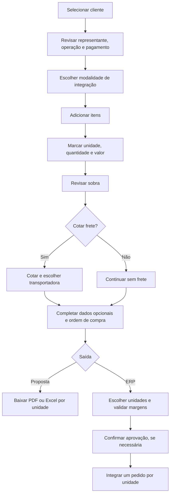

# 07 — Guia operacional do simulador

## 1. Objetivo

Este guia orienta o uso diário da tela **Pedido de Venda**, desde a escolha do cliente até a emissão de uma proposta ou o envio ao ERP. Ele descreve o comportamento implementado em **18/08/2026**.

> **Importante:** proposta e pedido ERP são saídas diferentes. Emitir uma proposta apenas baixa arquivos no navegador; não cria pedido no ERP. O pedido só é integrado pelo botão **Enviar pedido ao ERP**.

## 2. Visão rápida da jornada



## 3. Antes de começar

Tenha disponíveis, conforme o objetivo:

- código ou nome do cliente;
- operação e condição de pagamento;
- produtos, quantidades e preços negociados;
- ordem de compra, obrigatória apenas para o ERP;
- endereço de entrega, caso seja diferente ou precise constar na proposta/integração;
- dados de triangulação, quando aplicável;
- definição da modalidade `2 — Orçamento` ou `7 — Orçamento/Contrato`.

O sistema usa duas unidades:

| Código | Unidade |
|---:|---|
| 201 | Matriz |
| 203 | Filial |

Cada produto incluído é preparado para as duas unidades. A seleção, quantidade, preço, frete, sobra, proposta e situação ERP são tratados separadamente por unidade.

## 4. Preencher o cabeçalho do pedido

### 4.1. Selecionar o cliente

Há duas formas:

1. digite o código no campo **Cliente** e saia do campo; ou
2. clique na lupa, localize o cliente na LOV e selecione-o.

Depois da seleção, aguarde o loading. A tela consulta e preenche, quando disponíveis:

- nome e detalhes do cliente;
- representante padrão;
- operação padrão;
- condição de pagamento padrão;
- consumidor final;
- situação financeira;
- observações cadastradas;
- histórico e últimas compras.

Ao trocar o cliente, o endereço e a transportadora selecionada anteriormente são limpos. Itens já existentes são reconsultados para o novo contexto.

#### Indicador ao lado do cliente

| Cor | Significado atual |
|---|---|
| Verde | Compra recente, até 45 dias |
| Amarelo | Compra antiga, acima de 45 dias |
| Vermelho | Nunca comprado ou sem histórico válido |

Passe o mouse sobre o indicador para consultar os dias sem compra e a data da última compra.

### 4.2. Confirmar o representante

O representante pode vir automaticamente do cliente. Para alterar:

- informe o código e saia do campo; ou
- use a lupa.

A busca pela lupa exige que o cliente esteja selecionado. O representante não é obrigatório na validação atual do ERP, mas deve ser conferido quando fizer parte do processo comercial.

### 4.3. Confirmar a operação

A operação pode vir do cadastro do cliente. Alterá-la reconsulta preço e tributação dos itens existentes.

> **Boa prática:** depois de trocar a operação, aguarde o loading terminar e revise preços, seleção dos itens, impostos e sobra antes de continuar.

### 4.4. Confirmar a condição de pagamento

A condição também pode vir automaticamente. O indicador ao lado do campo apresenta, quando disponíveis:

- prazo médio de pagamento;
- limite mensal;
- percentual consumido;
- títulos vencidos.

| Cor | Significado atual |
|---|---|
| Verde | Situação financeira regular |
| Amarelo | Limite fora da faixa ou títulos vencidos |
| Vermelho | Limite fora da faixa e títulos vencidos |

Essas cores são informativas e não bloqueiam o pedido.

> **Limitação conhecida:** trocar manualmente a condição de pagamento não dispara o mesmo recálculo global executado na troca de cliente ou operação. Para evitar trabalhar com tributação/preço antigo, defina a condição antes de adicionar os itens. Se precisar alterá-la depois, remova e inclua novamente os itens ou valide o resultado com o suporte.

### 4.5. Consumidor final

É um campo somente leitura, preenchido a partir do cadastro detalhado do cliente.

### 4.6. Escolher a modalidade de integração

O padrão é **2 — Orçamento**. Clique no botão da modalidade para alternar:

| Modalidade | Uso no ERP sem restrição de margem |
|---|---|
| `2 — Orçamento` | `numSeqConf = 2` e situação `6` |
| `7 — Orçamento/Contrato` | `numSeqConf = 7` e situação `32` |

Se houver margem abaixo do mínimo, qualquer uma das modalidades usa situação `70`. A modalidade não aparece na proposta comercial.

## 5. Adicionar itens

### 5.1. Abrir a seleção

Clique em **+ Item**. A tela exige previamente:

- cliente;
- operação;
- condição de pagamento.

### 5.2. Pesquisar na LOV

A LOV abre com filtro inicial `POLIMAX`. Você pode pesquisar por:

- código;
- descrição;
- princípio ativo;
- marca.

Procedimento:

1. informe o texto em **Localizar**;
2. pressione Enter, Tab ou clique em **BUSCAR**;
3. marque um ou vários produtos;
4. clique em **Adicionar selecionados**.

Características úteis:

- são apresentados 25 registros por página;
- as setas inferiores mudam de página;
- clicar nos cabeçalhos ordenáveis alterna crescente, decrescente e sem ordenação;
- **Marcar todos** marca somente a página exibida;
- itens que já estão no pedido aparecem desabilitados;
- seleções feitas em páginas diferentes são preservadas até a inclusão.

Durante a consulta, o loading principal cobre toda a área visível da lista. Os preços de 201 e 203 podem continuar exibindo pequenos spinners enquanto são consultados.

### 5.3. Resultado da inclusão

Cada produto cria uma linha lógica à esquerda e duas linhas operacionais:

- uma em 201;
- uma em 203.

Depois da inclusão, aguarde o carregamento de estoque, preço, custo, tributação, múltiplo, peso, volume, acordos e histórico.

## 6. Trabalhar na grade de itens

### 6.1. Escolher a unidade de envio

Use o checkbox **Enviar** em cada unidade. Somente itens marcados participam de:

- totais;
- cotação de frete;
- proposta;
- avaliação de margem;
- integração ERP.

O menu **Selecionar** de cada unidade permite marcar ou desmarcar todos os itens daquela unidade. Item sem tributação permanece desmarcado.

O ícone de lixeira na tabela principal remove o produto inteiro, tanto da 201 quanto da 203.

### 6.2. Informar a quantidade

- A quantidade deve ser maior que zero para cotação e ERP.
- Quando o produto possui múltiplo, a quantidade precisa ser divisível por ele.
- Ao sair de uma quantidade incompatível, o sistema mostra uma mensagem e limpa o campo.
- A tela não bloqueia quantidade superior ao estoque exibido.

> **Boa prática:** estoque é informativo. Confirme disponibilidade comercial antes de concluir quando a quantidade exceder o estoque.

### 6.3. Informar o valor unitário

O campo aceita digitação natural com até quatro casas decimais:

- `9,30`;
- `9.3`;
- `9,3015`.

Não é necessário preencher zeros até a quarta casa. O ERP recebe o valor formatado com quatro casas.

Regras especiais:

- preço promocional pode ser aumentado, mas não reduzido abaixo do valor retornado;
- preço de contrato fica bloqueado;
- ao alterar o preço, a sobra é recalculada automaticamente.

### 6.4. Informar a sobra desejada

Também é possível alterar diretamente **Sobra %**. Ao sair do campo, a tela calcula o preço necessário para atingir a margem solicitada.

- O preço resultante mantém quatro casas.
- A sobra solicitada deve ser menor que o limite matemático disponível depois dos tributos.
- Em lista promocional, o preço calculado não pode ficar abaixo do mínimo.
- Em contrato, preço e sobra ficam desabilitados.
- Apenas passar pelo campo sem mudar o conteúdo não recalcula o preço.

### 6.5. Ler os totais

Cada unidade possui três cartões:

- **Valor total:** soma de quantidade × preço dos itens marcados.
- **Frete:** valor e percentual, ou “Não cotado”.
- **Sobra:** valor e percentual da unidade.

A sobra considera custo, impostos e frete rateado. Funrural é exibido no detalhe, mas não reduz a sobra no cálculo atual.

> **Atenção:** verde significa sobra monetária não negativa. Não significa, por si só, que o mínimo de 4% ou 6% foi atingido.

## 7. Navegação rápida pelo teclado

Enter, Tab e as respectivas combinações com Shift percorrem os campos visíveis e habilitados nesta ordem:

```text
201: todas as quantidades
  → todos os valores
  → todas as sobras
203: todas as quantidades
  → todos os valores
  → todas as sobras
```

| Tecla | Comportamento |
|---|---|
| Enter | Avança; no último campo, volta ao primeiro |
| Shift + Enter | Retrocede; no primeiro, volta ao último |
| Tab | Avança; na extremidade, segue o fluxo normal do navegador |
| Shift + Tab | Retrocede; na extremidade, segue o fluxo normal |

O conteúdo do próximo campo é selecionado, facilitando a substituição. Campos desabilitados são ignorados.

Quando uma mensagem possui somente **OK**, o botão recebe foco automaticamente. Pressione Enter para fechá-la. Se a mensagem estiver ligada a um campo inválido, o foco retorna ao campo depois do fechamento.

## 8. Entender cores, símbolos e informações

Clique ou posicione o foco no pequeno ícone `i` ao lado de **Itens** para consultar a legenda.

| Cor/símbolo | Significado |
|---|---|
| Roxo + `©` | Acordo comercial |
| Verde + `✓` | Produto presente nas últimas compras do cliente |
| Laranja + `$` | Preço bloqueado por contrato; a legenda atual também o descreve como promocional |
| Marrom | Item sem tributação |
| Vermelho + ampulheta | Lote com validade próxima |

Quando mais de uma condição existe, a cor segue esta prioridade:

1. sem tributação;
2. lote próximo;
3. preço bloqueado;
4. acordo;
5. última compra.

Os símbolos podem continuar aparecendo juntos.

### 8.1. Segmentos e margens

| Classificação técnica | Segmento exibido | Mínimo individual |
|---|---|---:|
| A ou B | AC | 4% |
| I ou T | MMT | 6% |
| Outra/não retornada | Sem regra individual | Não aplicada |

O mínimo do total de cada unidade é sempre **6%**.

### 8.2. Ícone “Info” da linha

Passe o mouse no ícone para consultar:

- impostos e percentuais;
- Funrural;
- frete rateado;
- sobra monetária;
- transportadora e prazo;
- última compra e ticket médio;
- pedidos de acordo;
- até cinco compras recentes.

## 9. Cotar o frete

### 9.1. Preparar a cotação

Antes de clicar em **Cotar SimFrete**:

1. marque exatamente os itens que devem participar;
2. confira a unidade de cada seleção;
3. informe quantidades positivas;
4. confirme o cliente e a cidade cadastral.

### 9.2. Processamento

O sistema:

1. limpa a seleção de frete anterior;
2. agrupa os itens por unidade;
3. solicita uma cotação para cada unidade com itens marcados;
4. seleciona automaticamente a primeira transportadora retornada;
5. rateia o valor entre os itens;
6. recalcula as sobras.

O rateio usa o maior valor entre peso real e peso cubado. Quando ambos são zero para todos os itens, usa a quantidade.

### 9.3. Escolher outra transportadora

No cartão **Frete**, abra o ícone `i` e clique na alternativa desejada. A troca refaz o rateio e a sobra.

### 9.4. Cuidados após cotar

> **Limitação conhecida:** alterar quantidade, seleção, preço, cliente, operação ou itens depois da cotação não garante invalidação ou novo rateio automático. Sempre clique novamente em **Cotar SimFrete** depois de qualquer alteração relevante.

> **Limitação conhecida:** a cotação usa a cidade do cadastro do cliente, não a cidade digitada na seção de endereço de entrega.

> **Limitação conhecida:** preço digitado com vírgula pode não ser convertido corretamente no payload atual do SimFrete. Se a cotação falhar após alteração manual de preço, registre o caso com o suporte.

## 10. Incluir observações

As observações cadastradas para o cliente aparecem automaticamente sem destino marcado. É possível:

- clicar em uma linha para editar;
- usar **+ Adicionar** para criar;
- usar a lixeira para remover;
- marcar um ou mais destinos.

Destinos disponíveis:

- Pedido.
- Nota fiscal.
- Registro de saídas.
- Contas a receber.

Somente observações com algum destino entram no ERP. Na proposta, entram apenas as marcadas como **Pedido**.

Cliente, operação e condição de pagamento são exigidos para abrir uma nova observação.

## 11. Informar a ordem de compra

O campo aceita até 20 caracteres.

- É obrigatório no envio ao ERP.
- É opcional na proposta.
- Não use `/` nem `|`.

Ao sair do campo com um desses caracteres, a tela apresenta mensagem e retorna o foco para correção.

## 12. Preencher triangulação, quando aplicável

Na seção **Triangulação**, informe opcionalmente:

- cliente de remessa;
- operação de remessa.

Esses campos viram `codClienteRemessa` e `codOperRemessa` no ERP. Eles não aparecem na proposta.

> **Atenção:** a tela não exige atualmente que cliente e operação de triangulação sejam preenchidos em conjunto. A responsabilidade de conferir a combinação é do usuário.

## 13. Preencher o endereço de entrega

Há quatro caminhos:

1. **PADRÃO:** usa o endereço padrão do cliente.
2. **ENDEREÇOS:** abre a lista de endereços cadastrados.
3. Consulta por CEP, cidade ou UF.
4. Digitação manual.

Campos disponíveis:

- CEP;
- UF;
- cidade e código IBGE;
- tipo de logradouro;
- logradouro;
- número;
- complemento;
- bairro;
- referência;
- data da carga.

Selecionar um CEP preenche logradouro, bairro, tipo, cidade e UF quando a API retorna esses dados.

O ERP recebe atualmente logradouro, código do tipo, bairro, código da cidade, CEP, número e data. Complemento e referência não são enviados em `peEndEntrega`. No documento comercial, o PDF apresenta ambos; o Excel apresenta o complemento, mas omite a referência no comportamento atual.

> **Boa prática:** evite endereço parcial. Número não numérico, como `S/N`, é reduzido a dígitos no payload atual e pode resultar em zero.

> **Atenção:** os ícones de apagar ao lado de UF e cidade limpam toda a seção de endereço, inclusive a data da carga.

## 14. Emitir proposta

### 14.1. Pré-requisitos

- Cliente selecionado.
- Condição de pagamento selecionada.
- Pelo menos um item marcado.

Operação e ordem de compra não são obrigatórias para a proposta.

### 14.2. Gerar

1. Clique em **Emitir proposta**.
2. Escolha **PDF** ou **Excel**.
3. Aguarde “Gerando arquivos...”.
4. Autorize o navegador a baixar vários arquivos, se solicitado.

O sistema consulta novamente o contato do cliente e gera **um arquivo separado para cada unidade com itens marcados**.

### 14.3. Conteúdo

A proposta inclui, conforme disponibilidade:

- logotipo e dados da empresa/unidade;
- emissão e validade de 15 dias;
- código, nome, CNPJ, telefone e e-mail do cliente;
- representante;
- condição de pagamento;
- ordem de compra no PDF; o Excel atual não a apresenta;
- endereço e data de carga; a referência do endereço aparece somente no PDF atual;
- itens marcados, com código, descrição, princípio ativo, marca, quantidade e valores;
- observações marcadas para pedido;
- transportadora, prazo e frete, somente quando cotado;
- total dos produtos e total da proposta.

Não inclui:

- sobra;
- modalidade de integração;
- operação;
- situação ERP;
- itens desmarcados.

O arquivo é somente baixado; não há gravação de proposta no backend.

## 15. Enviar o pedido ao ERP

### 15.1. Checklist obrigatório

Antes de clicar em **Enviar pedido ao ERP**, confirme:

- há ao menos um item marcado;
- todos os itens marcados possuem quantidade maior que zero;
- não há item marcado sem tributação;
- cliente, operação e condição estão preenchidos;
- ordem de compra está preenchida e sem `/` ou `|`;
- modalidade está correta;
- frete foi recotado após a última alteração, quando aplicável;
- valores e sobras estão revisados.

A validação atual não exige representante, endereço, frete, estoque suficiente ou preço maior que zero. Esses pontos devem ser conferidos operacionalmente.

### 15.2. Escolher unidades

A janela mostra apenas unidades que possuem itens marcados. Todas as disponíveis começam selecionadas.

1. desmarque a unidade que não deve ser integrada;
2. clique em **Confirmar**.

Cada unidade selecionada gera um pedido e um payload independentes.

### 15.3. Entender a situação calculada

Para cada unidade, o sistema avalia:

- sobra total mínima de 6%;
- AC mínimo de 4%;
- MMT mínimo de 6%.

Item de contrato não participa da regra individual, mas continua compondo o total.

| Condição da unidade | Modalidade 2 | Modalidade 7 |
|---|---:|---:|
| Total e itens dentro dos mínimos | Situação 6 | Situação 32 |
| Total abaixo de 6% | Situação 70 | Situação 70 |
| Total adequado, mas AC/MMT abaixo do mínimo | Situação 70 | Situação 70 |

### 15.4. Confirmar situação 70

Se alguma unidade precisar de aprovação, o modal informa a unidade e o motivo.

- **Não:** fecha a mensagem e mantém a tela para edição.
- **Sim, enviar:** integra todas as unidades escolhidas com suas situações calculadas; as unidades afetadas usam 70 e as demais podem usar 6 ou 32.

Quando o total está abaixo de 6%, a mensagem atual prioriza o total e pode não listar também os itens individuais abaixo da regra.

> **Limitação conhecida:** o “Item seq.” da confirmação usa uma sequência técnica por unidade e pode não coincidir com a coluna **Seq.** visível.

### 15.5. Resultado

No sucesso, a tela apresenta um número de pedido para cada unidade integrada. Ao fechar a mensagem com **OK**, todos os campos são limpos e a modalidade volta para 2.

Em erro, anote:

- texto da mensagem;
- etapa indicada;
- eventual número de pedido já gerado;
- unidades selecionadas;
- horário da tentativa.

> **Risco operacional:** as unidades são enviadas em paralelo. Uma pode ser criada e a outra falhar. Antes de repetir o envio, confira no ERP se algum pedido já foi gerado para evitar duplicidade.

## 16. Mensagens e loading

- O loading de tela inteira bloqueia interação durante cargas e integrações importantes.
- Mensagem apenas com **OK** fecha com Enter.
- Mensagem de aprovação usa botões vermelho **Não** e verde **Sim, enviar**.
- Fechar uma mensagem de validação normalmente devolve o foco ao campo relacionado.
- Fechar a mensagem de sucesso do ERP limpa a tela; não a feche antes de registrar os números dos pedidos.

## 17. Checklist resumido de uso seguro

### Para proposta

- [ ] Cliente correto.
- [ ] Condição de pagamento correta.
- [ ] Apenas os itens/unidades desejados estão marcados.
- [ ] Quantidades e valores revisados.
- [ ] Frete cotado, se deve aparecer.
- [ ] Endereço e contato conferidos.
- [ ] PDF ou Excel baixado para cada unidade esperada.

### Para ERP

- [ ] Cliente, operação e condição corretos.
- [ ] Modalidade correta.
- [ ] Itens e unidades corretos.
- [ ] Quantidades respeitam múltiplos.
- [ ] Valores e margens revisados.
- [ ] Frete recotado depois da última alteração.
- [ ] Ordem de compra válida.
- [ ] Triangulação conferida.
- [ ] Endereço conferido.
- [ ] Situação 6, 32 ou 70 compreendida antes da confirmação.
- [ ] Números dos pedidos registrados após o retorno.

## 18. Limitações operacionais conhecidas

| Tema | Comportamento atual | Conduta recomendada |
|---|---|---|
| Condição alterada após incluir itens | Não há recálculo global explícito | Definir antes dos itens ou reincluí-los |
| Mudança após cotação | Frete pode permanecer desatualizado | Recotar sempre |
| Endereço alternativo | SimFrete usa cidade cadastral do cliente | Validar destino com suporte quando divergente |
| Preço com vírgula no frete | Conversão pode falhar no payload do SimFrete | Registrar erro e validar valor enviado |
| Quantidade maior que estoque | Não bloqueia | Conferir disponibilidade |
| Preço zero no ERP | Validação atual não bloqueia | Revisar todos os valores |
| Complemento e referência | Não seguem no `peEndEntrega` | Colocar informação essencial em observação, se autorizado |
| Número alfanumérico | Payload preserva apenas dígitos | Validar endereço resultante |
| Cor verde de sobra | Indica apenas valor não negativo | Conferir os mínimos da legenda |
| Sequência na aprovação | Pode divergir da sequência visível | Identificar também pelo código do item |
| Duas unidades em paralelo | Pode ocorrer sucesso parcial | Conferir ERP antes de reenviar |
| Arredondamento de margem | Comparação final usa duas casas | Em valores limítrofes, revisar com atenção |
