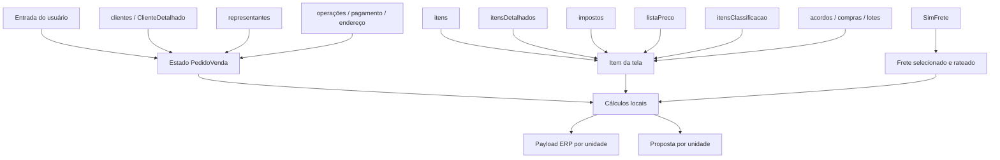

# 11 — Glossário e dicionário de dados

## 1. Convenções

Este documento descreve termos, constantes, estados e proveniência dos dados do simulador.

Convenções de nomes:

- `snake_case`, como `cod_item`, normalmente representa retorno das APIs legadas/ORDS;
- `camelCase`, como `codItem`, normalmente representa estado React, modelo de proposta ou contrato ERP;
- código numérico pode ser mantido como string na tela e convertido apenas na integração;
- valor monetário pode existir como número, string decimal com ponto ou string localizada com vírgula;
- campos opcionais vazios são, em geral, removidos do payload ERP.

## 2. Glossário de negócio e técnico

| Termo | Definição |
|---|---|
| **AC** | Segmento exibido para classificações técnicas `A` e `B`; margem individual mínima de 4% |
| **Acordo comercial** | Relação cliente/item retornada por `itensAcordos`; gera destaque visual e informação de pedidos associados |
| **Condição de pagamento** | Código/descrição comercial; também compõe a chave da tributação |
| **Consumidor final** | Indicador `ind_consumidor` vindo do cliente detalhado e enviado como `indConsumidor` |
| **DIFAL** | Diferencial de alíquota calculado quando a regra fiscal contém `DIF` |
| **ERP/NL** | Sistema de destino do pedido integrado |
| **FCP** | Fundo de Combate à Pobreza; tributo subtraído da sobra |
| **Frete cotado** | Alternativa retornada pelo SimFrete e selecionada para uma unidade |
| **Frete rateado** | Parcela do frete atribuída a cada item selecionado da unidade |
| **Funrural** | Percentual/valor exibido separadamente; não reduz a sobra no comportamento atual |
| **Item de contrato** | Lista com `tip_aplicacao = 1`; preço e sobra ficam bloqueados e a regra individual AC/MMT não é aplicada |
| **Item promocional** | Lista cujo `ind_promocao = 1`; o preço original se torna o mínimo permitido |
| **LOV** | *List of Values*; modal de pesquisa e seleção |
| **MMT** | Segmento exibido para classificações técnicas `I` e `T`; margem individual mínima de 6% |
| **Modalidade de integração** | Define `numSeqConf` e a situação normal do pedido: 2 ou 7 |
| **OC** | Ordem de compra do cliente; obrigatória para o ERP e opcional na proposta |
| **ORDS** | Camada HTTP usada para consultas cadastrais, comerciais e tributárias |
| **Pedido por unidade** | Cada unidade selecionada gera payload, número ERP e resultado próprios |
| **PMV** | Prazo médio de venda retornado no detalhe do cliente |
| **Proposta** | Arquivo PDF ou Excel local, separado por unidade; não cria registro no backend |
| **Situação 6** | Situação normal da modalidade 2 quando não há desvio de margem |
| **Situação 32** | Situação normal da modalidade 7 quando não há desvio de margem |
| **Situação 70** | Pedido encaminhado para aprovação por desvio de margem |
| **Sobra bruta** | Venda menos custo médio |
| **Sobra real** | Sobra bruta menos impostos considerados e frete rateado |
| **Sobra total** | Soma da sobra real dividida pela venda dos itens selecionados da unidade |
| **ST** | Substituição tributária; pode usar lista, índice ou preço de venda como base |
| **Triangulação/remessa** | Cliente e operação opcionais enviados como destino de remessa |
| **Unidade 201** | Matriz |
| **Unidade 203** | Filial |

## 3. Constantes de negócio e integração

| Constante | Valor atual | Uso | Fonte |
|---|---:|---|---|
| Empresa ERP | `01` | `codEmp` no envelope, pedido e endereço | `PedidoVenda.js` |
| Complemento ERP | `99` | `codCompl` do pedido/endereço | `PedidoVenda.js` |
| Máquina | `1` | `codMaquina` | `PedidoVenda.js` |
| Reserva | `7` | `codReserva` de todo item | `PedidoVenda.js` |
| Tipo de transação | `1` | pedido, item, observação e endereço | `PedidoVenda.js` |
| Tipo de frete ERP | `1` | `tipFrete` fixo | `PedidoVenda.js` |
| Valor alterado | `0` | `indVlrAlterado` fixo | `PedidoVenda.js` |
| Modalidade padrão | `2` | Orçamento | `PedidoVenda.js` |
| Modalidade alternativa | `7` | Orçamento/Contrato | `PedidoVenda.js` |
| Situação normal modalidade 2 | `6` | sem desvio | `PedidoVenda.js` |
| Situação normal modalidade 7 | `32` | sem desvio | `PedidoVenda.js` |
| Situação de aprovação | `70` | qualquer desvio de margem | `PedidoVenda.js` |
| Margem total mínima | `6%` | por unidade | `PedidoVenda.js` |
| Margem AC | `4%` | classificações A/B | `PedidoVenda.js` |
| Margem MMT | `6%` | classificações I/T | `PedidoVenda.js` |
| Cubagem | `300 kg/m³` | rateio do frete | `PedidoVenda.js` |
| Página padrão | `25` | maioria das LOVs/APIs | serviços/componentes |
| Cache padrão | `5 min` | clientes, itens, lotes e impostos | serviços/componentes |
| Validade da proposta | `15 dias` | a partir da emissão | `propostaConfig.js` |
| Filtro inicial de itens | `POLIMAX` | primeira visão da LOV | `LovItens.js` |
| Concorrência de enriquecimento | `3` | itens na tela | `PedidoVenda.js` |
| Concorrência fiscal da LOV | `4` | itens visíveis | `LovItens.js` |
| Concorrência de acordos | `5` | itens visíveis | `LovItens.js` |
| Timeout ORDS backend | `20 s` | proxy Unimed | `server.js` |
| Timeout SimFrete | `20 s` | frontend e externo | configuração/backend |
| Timeout ERP | `30 s` | frontend e externo | serviço/backend |
| Limite do JSON | `1 MB` | Express | `server.js` |

## 4. Cadastro das unidades

| Unidade | Nome | CNPJ da proposta | CNPJ SimFrete | CEP de origem |
|---:|---|---|---|---:|
| 201 | Matriz | `02.494.715/0001-73` | `02494715000173` | `92120190` |
| 203 | Filial | `02.494.715/0004-16` | `02494715000416` | `29167650` |

Dados institucionais da proposta:

```text
Nome: Unimed Central de Serviços - RS
Telefone: (51) 3462-6400
E-mail: vendas@centralrs.unimed.com.br
Logo: src/imagens/nlprod2023.png
```

Fonte: `src/config/propostaConfig.js` e `propostaAssetsService.js`.

## 5. Mapa de fontes



## 6. Estado principal da tela

| Estado | Tipo conceitual | Origem | Uso |
|---|---|---|---|
| `cliente` | objeto/null | `clientes` ou LOV | identificação, APIs, ERP e proposta |
| `clienteDetalhado` | objeto/null | `ClienteDetalhado` | defaults, crédito, consumidor e frete |
| `clienteTriangulacao` | objeto/null | catálogo de clientes | `codClienteRemessa` |
| `representante` | objeto/null | representantes | tela, ERP e proposta |
| `operacao` | objeto | detalhe/LOV | tributação e `codOper` |
| `operacaoTriangulacao` | objeto | LOV | `codOperRemessa` |
| `CondPgto` | objeto | detalhe/LOV | tributação, ERP e proposta |
| `prazoMedioVenda` | número/null | detalhe do cliente | indicador visual |
| `clienteConsumidor` | boolean | detalhe do cliente | exibição; ERP lê o detalhe |
| `creditoCliente` | objeto | detalhe do cliente | indicadores de crédito |
| `modalidadeIntegracao` | `2` ou `7` | usuário; padrão 2 | `numSeqConf` e situação normal |
| `itensPedido` | array | item + enriquecimentos + usuário | cálculo, frete, proposta e ERP |
| `freteSelecionado` | mapa por unidade | SimFrete/usuário | rateio, totais e proposta |
| `cotacoesFrete` | mapa por unidade | SimFrete | alternativas de transportadora |
| `observacoes` | array | comentários/usuário | tela, proposta e ERP |
| `ordemCompra` | string | usuário | ERP e proposta |
| `uf`, `cidade` | objeto/null | CEP/cidade/UF | endereço visual/proposta |
| campos de endereço digitados | strings | usuário/APIs | proposta e parte do ERP |
| `lotesProximosMap` | mapa | `itensLotes` | destaque visual |
| `ultimasComprasClienteMap` | mapa | `clientesUltimaCompra` | histórico por item |
| `historicoCliente` | objeto | `clientesHistorico` | indicador de recência |

Estados `openLov*`, menus, modais e `loading` são exclusivamente de interface e não fazem parte do payload.

## 7. Dicionário do item em `itensPedido`

### 7.1 Identidade e apresentação

| Campo | Significado | Proveniência |
|---|---|---|
| `grupoId` | liga as cópias 201 e 203 do mesmo produto | contador local |
| `seq` | identidade única da linha/unidade | contador local |
| `numItem` | número comercial enviado ao ERP | contador local por produto |
| `cod_item` | código do produto | `itens` |
| `descricao` | descrição | `des_item` de `itens` |
| `principiosAtivos` | princípio ativo | `principios_ativos` |
| `marca` | marca/código completo | `cod_completo` |
| `unidade` | 201 ou 203 | criada localmente |
| `classificacao` | código técnico A/B/I/T etc. | `itensClassificacao.des_geral` |

### 7.2 Estoque, custo e logística

| Campo | Significado | Proveniência |
|---|---|---|
| `estoque` | estoque da unidade | `itensDetalhados.qtd_estoque_*` |
| `vlrMedio` | custo médio unitário | `itensDetalhados.vlr_medio_unitario_*` |
| `qtdMultiplo` | múltiplo permitido | `qtd_multiplo` |
| `qtdAltura` | altura | `qtd_altura` |
| `qtdLargura` | largura | `qtd_largura` |
| `qtdComprimento` | comprimento | `qtd_comprimento` |
| `qtdM3` | volume unitário | `qtd_m3` |
| `qtdM2` | área unitária | `qtd_m2` |
| `pesoBruto` | peso bruto unitário | `qtd_peso_bruto` |
| `ticktMedio` | ticket médio | `ticket_medio` |

### 7.3 Preço, seleção e cálculo

| Campo | Significado | Proveniência |
|---|---|---|
| `quantidade` | quantidade negociada | usuário ou múltiplo/default |
| `valorLista` | preço unitário usado na venda | `impostos.vlr_item`, editável conforme regra |
| `codListaPreco` | lista aplicada | `impostos.cod_lista` |
| `infoListaPreco` | metadados da lista | `listaPreco` |
| `precoListaPromocional` | preço possui mínimo promocional | derivado de `ind_promocao` |
| `valorMinimoLista` | limite inferior | preço original promocional |
| `precoListaBloqueado` | contrato; edição bloqueada | derivado de `tip_aplicacao` |
| `sobraDesejada` | percentual digitado para cálculo inverso | usuário |
| `selecionado` | item participa das saídas | usuário/regra tributária |
| `valorFrete` | parcela de frete do item | cálculo local |
| `semTributacao` | ausência de tributação | `num_seq_busca == null` |

`valorLista` pode alternar entre número e string localizada. Antes de cálculos/integração deve ser normalizado por conversão decimal brasileira.

### 7.4 Fiscal

Objeto interno `impostos`:

| Campo interno | Campo da API | Uso |
|---|---|---|
| `perIcms` | `per_icms` | ICMS |
| `perPis` | `per_aliq_pis` | PIS |
| `perCofins` | `per_aliq_cofins` | COFINS |
| `perIpi` | `per_ipi` | IPI |
| `perFcp` | `per_fcp` | FCP |
| `perSubstTrib` | `per_subst_trib` | ST |
| `perDifal` | diferença entre ST e ICMS | DIFAL |
| `difal` | `txt_refaz_bc_st` | identifica regra DIF |
| `idxSubsTrib` | `idx_subs_trib` | base indexada de ST |
| `listaST` | `cod_lista_st` | lista usada como base ST |
| `perFunrural` | `per_funrural` | cálculo informativo |
| `indSubsMercadoria` | `ind_subs_mercadoria` | habilita ST/DIFAL |
| `codListaPreco` | `cod_lista` | lista principal |

`baseST` é calculada consultando o valor do item na `listaST`.

### 7.5 Informações auxiliares

| Campo | Origem | Uso |
|---|---|---|
| `acordosComerciais` | `itensAcordos` | legenda e detalhes |
| `ultimaCompraItem` | `itensUltimaCompra` | detalhe do item |
| `ultimaCompraItemDasUltimasCompras` | `clientesUltimaCompra` | destaque e ordenação |
| lote próximo | mapa externo por `cod_item` | cor e ampulheta |

## 8. Valores derivados

| Valor | Fórmula resumida |
|---|---|
| `valorVendaTotal` | quantidade × preço |
| `valorCustoTotal` | quantidade × custo médio |
| `totalImpostos` | ICMS + PIS + COFINS + IPI + DIFAL + ST + FCP |
| `sobraBruta` | venda − custo |
| `sobraReal` | sobra bruta − impostos − frete |
| `sobraPercentual` | sobra real ÷ venda × 100 |
| `valorFunrural` | venda × percentual; não reduz sobra |
| `pesoReal` | peso bruto × quantidade |
| `pesoCubado` | m³ × quantidade × 300 |
| `pesoCobranca` | maior entre real e cubado |

## 9. Mapeamento tela → ERP

### Envelope e pedido

| Destino ERP | Fonte | Tipo/formato |
|---|---|---|
| `codEmp` | constante | string `"01"` |
| `codMaquina` | constante | número `1` |
| `usuario` | query string | string opcional |
| `pePedidos.codUnidade` | grupo selecionado | número 201/203 |
| `pePedidos.numPedido` | placeholder frontend; sequence backend | string |
| `pePedidos.numSeqConf` | modalidade | número 2/7 |
| `pePedidos.codSituacao` | margem + modalidade | número 6/32/70 |
| `desNumOcCliente` | `ordemCompra` | string |
| `dtaEmissao`, `dtaDigitacao` | data local | `dd/MM/yyyy` |
| `codCondPgto` | `CondPgto.cod_cond_pgto` | string |
| `codOper` | `operacao.cod_oper` | string |
| `codOperRemessa` | operação de triangulação | string opcional |
| `indConsumidor` | `clienteDetalhado.ind_consumidor` | 0/1 |
| `codCliente` | `cliente.cod_pessoa` | string |
| `codClienteRemessa` | cliente de triangulação | string opcional |
| `codRepresentante` | `representante.cod_pessoa_rep` | string opcional |

### Item ERP

| Destino ERP | Fonte | Tipo/formato |
|---|---|---|
| `codItem` | `cod_item` | string |
| `codLista` | `codListaPreco` | string opcional |
| `qtdNegociada` | `quantidade` | número |
| `vlrUniBruto` | `valorLista` | string com vírgula e 4 casas |
| `codUnidadeRetira` | unidade do payload | número |
| `qtdReservada` | `quantidade` | número |
| `numItem` | contador local | número |
| `codReserva` | constante | 7 |
| `indVlrAlterado` | constante | 0 |

### Observação ERP

| Campo | Origem |
|---|---|
| `txtObs` | descrição |
| `indPedido` | checkbox Pedido |
| `indNf` | checkbox Nota Fiscal |
| `indRegistro` | checkbox Registro |
| `indCr` | checkbox Financeiro/CR |
| `numSeq` | posição entre observações enviadas |

Somente observações com ao menos uma marcação são enviadas. A proposta inclui somente observações marcadas para pedido.

### Endereço ERP

| Destino ERP | Fonte |
|---|---|
| `desEndereco` | tipo + logradouro |
| `desLogradouro` | logradouro digitado |
| `codLogradouro` | `cod_tipo` encontrado pela descrição |
| `desBairro` | bairro |
| `codCidade` | código IBGE numérico |
| `numCep` | somente dígitos, convertido em número |
| `numLogradouro` | somente dígitos, convertido em número |
| `dtaTransacao` | data de carga ou data atual |

Complemento, referência, UF e descrição da cidade não seguem no endereço ERP. O modelo comum da proposta mantém esses dados; o PDF apresenta complemento e referência, enquanto o Excel atualmente omite a referência.

## 10. Modelo comum da proposta

Cada unidade selecionada produz um objeto com:

```text
empresa
emissao
validade
cliente
representante
condicaoPagamento
ordemCompra
dataCarga
observacoes
enderecoEntrega
itens
frete
totalProdutos
totalProposta
```

Proveniência dos contatos do cliente, por prioridade:

```text
CNPJ:    clienteDetalhado.cnpj → num_cnpj_cpf → cliente.cnpj
Telefone: clienteDetalhado.telefone → num_fone → cliente.num_fone/telefone
E-mail:   clienteDetalhado.email → des_email → cliente.des_email/email
```

Antes da emissão, a tela tenta enriquecer `cliente` com `GET clientes/{codigo}`. Falha nessa chamada não bloqueia a exportação.

## 11. Estados de integração

### Situação funcional do pedido

| Código | Significado no simulador |
|---:|---|
| 6 | fluxo normal da modalidade 2 |
| 32 | fluxo normal da modalidade 7 |
| 70 | aprovação por margem |

### Status técnico Oracle

| Status | Significado |
|---|---|
| `ENVIANDO` | payload registrado e/ou envio em andamento; resultado ainda não conciliado |
| `INTEGRADO` | backend registrou sucesso do ERP |
| `ERRO` | backend registrou falha |

`ENVIANDO` não prova ausência no ERP, porque POST e auditoria não constituem uma transação única.

### Etapas técnicas

```text
inicio
conectar_oracle
gerar_numero_pedido
montar_payload_erp
inserir_controle_integracao
post_erp
atualizar_integracao_sucesso
atualizar_integracao_erro
```

Esses nomes representam etapas internas. Depois que conexão e número existem, o tratamento de falha normalmente altera `etapa` para `atualizar_integracao_erro` antes de responder ao navegador; o log emitido antes dessa alteração preserva a origem mais precisa. Uma falha de `atualizar_integracao_sucesso` acontece após a resposta HTTP de sucesso e não é devolvida ao frontend.

## 12. Estados visuais

### Histórico do cliente

| Condição | Estado |
|---|---|
| compra até 45 dias | compra recente |
| compra há mais de 45 dias | compra antiga |
| sem data válida | nunca comprado |

### Destaques de item

A precedência atual da classe da linha é:

1. sem tributação;
2. lote próximo;
3. preço bloqueado/contrato;
4. acordo comercial;
5. última compra.

Como apenas uma classe de linha é escolhida, um item com múltiplas condições mostra a de maior precedência, embora detalhes adicionais possam continuar disponíveis no ícone de informação.

## 13. Formatos e semântica de vazio

| Tipo | Formato atual |
|---|---|
| Preço digitado | vírgula ou ponto, até 4 casas |
| Preço ERP | `"9,3000"` |
| Percentual exibido | 2 casas |
| Frete rateado | 2 casas por item |
| Data ERP padrão | `dd/MM/yyyy` |
| Código de cidade ERP | número |
| CEP ERP | número |
| Resposta ORDS comum | `{ items, hasMore, count }` |

`limparCamposVazios` remove:

- `null`;
- `undefined`;
- string vazia;
- array vazio.

Não remove:

- zero;
- `false`;
- objeto vazio.

Por isso, um endereço parcial pode enviar `numCep: 0` ou `numLogradouro: 0`.

## 14. Caches e validade dos dados

| Dado | Escopo | Validade atual |
|---|---|---:|
| clientes completos | módulo | 5 min |
| itens completos | módulo | 5 min |
| lotes | módulo | 5 min |
| impostos | módulo/chave completa | 5 min |
| detalhe do cliente | tela | até desmontar |
| representante/histórico | tela | até desmontar |
| lista de preço | tela | até desmontar |
| acordos/última compra | tela ou módulo | até desmontar/recarregar |
| classificação visual | tela | até desmontar; avaliação ERP consulta novamente |

Limpar o formulário não elimina todos os caches baseados em `useRef`. Recarregar completamente a aplicação reinicia os caches do navegador.

## 15. Mapa de arquivos por domínio

| Domínio | Fonte principal |
|---|---|
| Estado e fluxo | `src/views/PedidoVenda.js` |
| Cliente | `src/services/clientes.js` |
| Item | `src/services/itens.js` |
| Fiscal | `src/services/impostos.js` |
| Lista de preço | `src/services/listaPreco.js` |
| Cadastros/endereços | `src/services/*.js` correspondentes |
| Frete | `src/config/simFreteService.js` |
| Pedido ERP frontend | `src/services/pedidosErp.js` |
| Backend/proxy/Oracle/ERP | `backend-simfrete/server.js` |
| Modelo da proposta | `src/services/proposta/propostaDataService.js` |
| PDF | `propostaPdfService.js` |
| Excel | `propostaExcelService.js` |
| Configuração da proposta | `src/config/propostaConfig.js` |

## 16. Pontos que exigem definição futura

1. Semântica definitiva de `tipFrete = 1` e ausência dos dados cotados no ERP.
2. Quando `indVlrAlterado` deve mudar para 1.
3. Envio de complemento, referência e UF no endereço.
4. Formato validado da data de carga.
5. Renumeração de `numItem` por payload/unidade.
6. Política de expiração/invalidação dos caches sem TTL.
7. Tratamento de item sem classificação AC/MMT.
8. Política de retenção de payloads e respostas no Oracle.
9. Identidade confiável do usuário da integração.
10. Idempotência e reconciliação entre frontend, Oracle e ERP.
