# Documentação do Simulador de Pedido de Venda

## Objetivo

Este conjunto de documentos descreve o funcionamento atual do simulador de pedido de venda, desde a seleção do cliente até a emissão de proposta e a integração com o ERP.

A documentação foi produzida a partir do código-fonte vigente em **18/08/2026**. O código continua sendo a fonte definitiva quando houver divergência.

| Propriedade | Valor |
|---|---|
| Baseline | Comportamento implementado (*as is*) |
| Versão documental | 1.0 |
| Data de referência | 18/08/2026 |
| Sistema | Simulador de Pedido de Venda |
| Unidades cobertas | 201 — Matriz; 203 — Filial |

## Públicos atendidos

- **Comercial e operação:** uso correto da tela e significado das validações.
- **Suporte:** diagnóstico de falhas, dependências e pontos de consulta.
- **Desenvolvimento:** arquitetura, estados, serviços, cálculos e contratos.
- **Qualidade:** cenários de aceite e regressão.
- **Infraestrutura:** configuração, publicação e integrações externas.

## Mapa da documentação

| Documento | Conteúdo |
|---|---|
| [01 — Visão geral e arquitetura](01-visao-geral-arquitetura.md) | Escopo, atores, componentes e visão sistêmica |
| [02 — Fluxo funcional da tela](02-fluxo-funcional-tela.md) | Jornada completa do usuário, seção por seção |
| [03 — Regras de negócio e cálculos](03-regras-negocio-calculos.md) | Itens, impostos, sobra, frete, classificação e situações |
| [04 — Integrações e catálogo de APIs](04-integracoes-apis.md) | Endpoints, caches, proxy, SimFrete, Oracle e ERP |
| [05 — Contrato do payload ERP](05-payload-erp.md) | Estrutura JSON, dicionário de campos e exemplos |
| [06 — Emissão de propostas](06-emissao-propostas.md) | PDF, Excel, modelo comum, conteúdo e manutenção |
| [07 — Guia operacional](07-guia-operacional.md) | Procedimento de uso e boas práticas |
| [08 — Suporte e troubleshooting](08-suporte-troubleshooting.md) | Sintomas, causas, verificações e recuperação |
| [09 — Estratégia e matriz de testes](09-matriz-testes.md) | Casos de teste funcionais, técnicos e de regressão |
| [10 — Implantação, segurança e manutenção](10-implantacao-seguranca-manutencao.md) | Ambientes, variáveis, containers e cuidados operacionais |
| [11 — Glossário e dicionário de dados](11-glossario-dados.md) | Termos de negócio, estados e principais objetos |
| [12 — Registro de riscos e roadmap técnico](12-registro-riscos-roadmap.md) | Riscos priorizados, critérios de aceite e evolução recomendada |

## Fluxo executivo

```mermaid
flowchart LR
    A[Selecionar cliente] --> B[Confirmar representante, operação e pagamento]
    B --> C[Adicionar itens]
    C --> D[Definir quantidade, preço e seleção por unidade]
    D --> E{Cotar frete?}
    E -- Sim --> F[SimFrete e rateio por item]
    E -- Não --> G[Sem frete]
    F --> H[Completar observações, OC e endereço]
    G --> H
    H --> I{Saída desejada}
    I -- Proposta --> J[PDF ou Excel por unidade]
    I -- Pedido --> K[Validar margens e situação]
    K --> L[Gerar payload por unidade]
    L --> M[Backend gera número e registra controle Oracle]
    M --> N[ERP]
```

## Princípios do funcionamento atual

1. Um produto adicionado cria representações independentes para as unidades **201 (Matriz)** e **203 (Filial)**.
2. Somente itens marcados participam de cotação, proposta e integração.
3. Frete, sobra total, aprovação e payload são tratados por unidade.
4. Cada fluxo pode produzir até dois resultados: dois pedidos no ERP ou dois arquivos de proposta, sempre separados por unidade.
5. A modalidade de integração define `numSeqConf` e a situação normal; violações de margem direcionam a unidade para situação `70`.
6. Dados comerciais e tributários são enriquecidos por APIs e podem ser recalculados quando cliente ou operação mudam.

## Convenções

- Nomes como `cod_item` representam campos recebidos das APIs legadas.
- Nomes como `codItem` representam campos enviados no contrato do ERP.
- “LOV” significa *List of Values*: janela de pesquisa e seleção.
- “Comportamento atual” descreve o que está implementado.
- “Ponto de atenção” identifica risco, limitação ou decisão que merece validação futura.

## Manutenção da documentação

Atualizar os documentos no mesmo conjunto de alterações sempre que houver mudança em:

- jornada ou validação da tela;
- fórmula, imposto, arredondamento, margem ou classificação;
- endpoint, cache ou contrato de resposta;
- campo, situação ou modalidade do payload ERP;
- conteúdo ou layout de PDF/Excel;
- configuração de ambiente, container, proxy ou credencial;
- procedimento de suporte e recuperação.

Alterações de regra devem atualizar também a [matriz de testes](09-matriz-testes.md). Riscos eliminados ou introduzidos devem ser refletidos no [registro de riscos](12-registro-riscos-roadmap.md).
